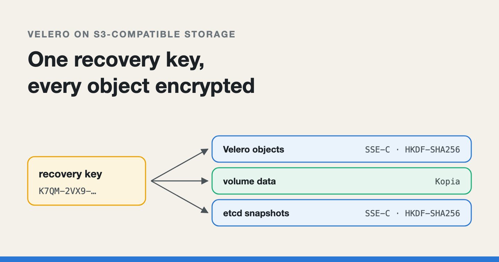
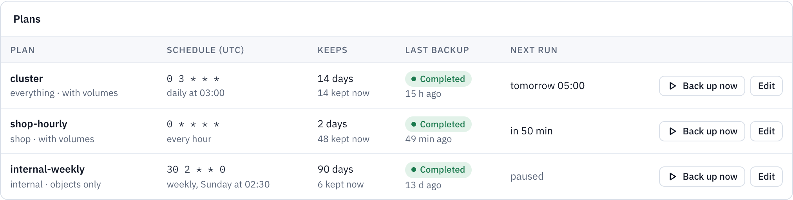
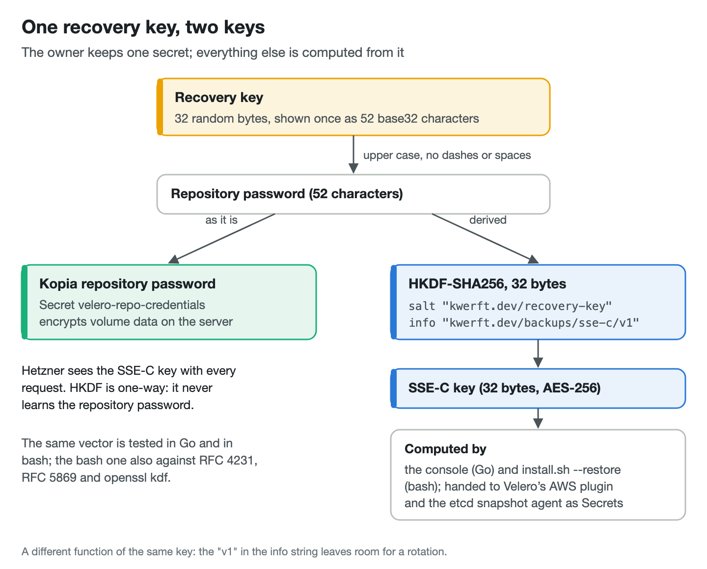

# Encrypting Velero backups on object storage that only offers SSE-C

*Kubernetes encrypts Secrets inside etcd, not inside your backups. How one
recovery key encrypts everything Kwerft's backups write to Hetzner Object
Storage, and two details of Velero's AWS plugin worth knowing before you
copy the idea.*



---

[Kwerft](https://kwerft.dev/?utm_source=medium&utm_medium=blog&utm_campaign=encrypted-backups)
is a self-hosted Kubernetes console for Hetzner servers. One bash installer
puts k3s, Cilium, Traefik, cert-manager, metrics, logs and a single Go
binary on a fresh Ubuntu server. Since the 0.6 release candidates it also
installs Velero and backs the whole cluster up to Hetzner Object Storage
(the latest stable release, v0.4.0, has no backups).

The problem is simple to state. k3s, the Kubernetes distribution Kwerft
runs, encrypts Secrets *inside etcd*. Velero doesn't read etcd. It reads
objects through the API server, which hands every Secret back decrypted,
and writes them into a tarball in the bucket. In Kwerft's case that tarball
holds every app's Secrets, the console's data key, its Hetzner and DNS
tokens and the Gateway's TLS keys. Hetzner Object Storage has no default
at-rest encryption, so without extra work all of that sits in the bucket as
readable JSON, the Secret values only base64-encoded.

This post walks through how Kwerft closes that gap with one key the owner
keeps: the storage's only encryption option, how one key becomes two, the
plugin setting that silently shortens a key file, the etcd snapshots that
needed their own uploader, and how a full restore onto a new server is
tested. I'll be clear about which parts I read in documentation and source
code, and which parts Kwerft's tests prove.

*I drafted this post with the help of an AI writing assistant. The system, the bugs and the numbers are Kwerft's own.*

## What a backup actually holds

A Kwerft "Cluster" backup takes every project namespace, the console's own
namespace and the build registry's, plus Kwerft's cluster-wide custom
resources. Volume data goes in by file system backup: Velero's node agent
copies the files with Kopia, a backup tool that encrypts on the client
before anything leaves the server. The Kopia repository password is the
recovery key, 32 random bytes the console shows once as 52 base32
characters in groups of four, and makes the owner download or copy before
the dialog closes.

So volume data was encrypted from the start. Everything *else* Velero
writes was not: the object tarball, the backup's log, its resource lists
and volume info. The first version of the design doc said so plainly in its
open questions, and the project's risk list named it: "Backups carry
secret values".


*Kwerft's console, with the demo data of a fictional web shop.*

## SSE-C or nothing

Hetzner's documentation is short on this. There is no default data-at-rest
encryption. The only encryption a bucket supports is SSE-C, server-side
encryption with a customer-provided key: every request carries a 32-byte
key, the storage encrypts the object with AES-256 and discards the key. The
same pages add three consequences. Copying an SSE-C object is not
supported. SSE-C does not encrypt metadata. And a lost key means lost data.

Velero has no client-side encryption for its own objects. Its AWS plugin
offers three server-side options: SSE with AES256, SSE-KMS, and SSE-C.
Hetzner offers neither storage-managed keys nor a KMS, which leaves one.
The alternative I rejected was an encrypting S3 proxy in front of the
bucket. It would work
with any storage, but it is another stateful hop on the data path that
holds the access keys. It would have to be run, upgraded, and restored
before anything else on a new server.


## One recovery key, two keys

The owner should still keep exactly one secret. So the SSE-C key is derived
from the recovery key with HKDF-SHA256, a standard key derivation function
(RFC 5869). Go has it in the standard library since 1.24:

```go
const (
	sseSalt = "kwerft.dev/recovery-key"
	sseInfo = "kwerft.dev/backups/sse-c/v1"
	// SSEKeyBytes is the length of an SSE-C key (AES-256).
	SSEKeyBytes = 32
)

// SSECustomerKey derives the SSE-C key of a recovery key (any form
// NormalizeRecoveryKey reads). ErrRecoveryKey when s is no key.
func SSECustomerKey(s string) ([]byte, error) {
	pw, err := RepositoryPassword(s)
	if err != nil {
		return nil, err
	}
	return hkdf.Key(sha256.New, []byte(pw), []byte(sseSalt), sseInfo, SSEKeyBytes)
}
```

`RepositoryPassword` is the key's 52 characters in upper case without
dashes or spaces, exactly what Kopia gets. Deriving instead of reusing
matters for two reasons. SSE-C wants exactly 32 bytes, and the password is
52 characters. More importantly, the storage sees the SSE-C key with every
request. It never sees the Kopia password, and it cannot compute it from a
value HKDF produced. The `v1` in the info string leaves room for a rotation
later.



The same derivation has to run in the installer, which is a single bash
file piped from curl. The obvious tool is `openssl kdf`, but the installer
doesn't use or install OpenSSL, and OpenSSL takes the key as a command-line
argument, visible to anyone on the box in `/proc/*/cmdline`. So the bash
version builds HMAC-SHA256 from shell builtins and `sha256sum` on pipes, and
HKDF from two HMACs:

```bash
sse_customer_key() {
  local password prk
  IFS= read -r password || [[ -n "$password" ]] || return 1
  prk=$(hmac_sha256 "$(str_hex kwerft.dev/recovery-key)" "$(str_hex "$password")") || return 1
  hmac_sha256 "$prk" "$(str_hex kwerft.dev/backups/sse-c/v1)01"
}
```

The first call is HKDF's extract step. The second is its expand step, cut
short: 32 bytes is one SHA-256 block, so the output is a single HMAC of the
info string followed by the counter byte `01`. Both implementations are
tested against one shared vector. The bash one is also checked against RFC
4231 and RFC 5869 test cases, and against `openssl kdf` where OpenSSL 3 is
present. RFC 5869's first case is there on purpose: its intermediate key has
a byte 0x36, which turns into a NUL inside the HMAC's inner pad, the kind of
byte shell strings like to drop.

## The plugin setting that shortens your key

velero-plugin-for-aws v1.14.4 (the version the installer pins, next to
Velero v1.18.4 and chart 12.2.0) has two ways to give it an SSE-C key. They
exclude each other and `kmsKeyId`.

The first, `customerKeyEncryptionFile`, is a path inside the Velero
container. Reading the plugin's source at that tag, the file is read with a
single call into a fixed buffer: `keyBytes := make([]byte, 32)`, then one
`Read`. The check that follows only catches a file that is too short. A
longer file is cut to its first 32 bytes without a word. If you store the
key the way people usually store keys, as 64 hex characters or as base64,
the plugin encrypts with the first 32 *characters* of that text. Your
backups would work. The day you try to read an object with the AWS CLI
and the full key, the storage would refuse it. And 32 of 64 hex
characters carry half the entropy you think the key has.

The second, `customerKeyEncryptionSecret`, names a Kubernetes Secret as
`<secret>/<key>`. The plugin reads it through the API, in the namespace
from `VELERO_NAMESPACE`, every time it initialises, and refuses anything
that isn't exactly 32 bytes. Kwerft uses this one. Here is the location as
the installer writes it during a restore:

```yaml
apiVersion: velero.io/v1
kind: BackupStorageLocation
metadata:
  name: kwerft
  namespace: velero
spec:
  provider: aws
  default: true
  accessMode: ReadOnly
  objectStorage:
    bucket: "<bucket>"
    prefix: "<prefix>/velero"
  credential:
    name: kwerft-bsl-credentials
    key: cloud
  config:
    region: "<region>"
    s3Url: "https://<region>.your-objectstorage.com"
    s3ForcePathStyle: "true"
    checksumAlgorithm: ""
    customerKeyEncryptionSecret: "kwerft-bsl-encryption/sse-c-key"
```

The location stays read-only until the restore is done. The empty
`checksumAlgorithm` keeps the AWS SDK from sending default checksum
headers that S3-compatible stores, Hetzner's among them, reject.

The exact length check is one reason to prefer the Secret. Timing is the
bigger one. A Secret mounted as a volume reaches a *running* pod only at the
kubelet's next sync, a minute or more later. The console writes the key and
the location together. With a mounted file, the location would fail
validation right after the first save because the file isn't there yet. The
owner would see an error in Settings, and on a new server a restore would
stall. The Secret needs no change to the Velero pod and no restart. The
price is that Velero's service account must read Secrets in its namespace.
The chart's default binds it to cluster-admin anyway, and the installer now
states that explicitly.

Order matters too. The console applies the encryption Secret *before* the
location, because the plugin must never write an object without its key. It
applies the Kopia password even earlier: Velero creates that Secret itself
at start, with a built-in default password, if it's missing, and the first
location would initialise the repository with it.

Two things the plugin's source settled. The key goes on PutObject,
HeadObject, GetObject and the presigned GET Velero hands out for downloads.
Listing and deleting need no key. And the plugin never calls CopyObject, so
Hetzner's copy limitation doesn't matter. Velero's Kopia repository is a
different story: in Velero v1.18.4 it takes only the bucket, prefix,
region, endpoint and TLS options from the location's config. Kopia's blobs
go without SSE-C, which is fine, because Kopia encrypted them first.

## Make sure the storage really encrypts

An S3-compatible store that doesn't implement SSE-C may simply ignore the
headers and keep the object in plain form. The upload succeeds and nothing
looks wrong. So the console's connection check, which runs on every save
with new keys, writes a test object with a random SSE-C key and then reads
it twice:

```go
SetSSEC(sse, sseKey)
content := []byte("kwerft connection check\n")
if err := c.do(ctx, t, cr, http.MethodPut, key, nil, sse, content, nil); err != nil {
	// … 400 and 501 are the storage refusing the encryption headers …
}
var got []byte
encErr := c.do(ctx, t, cr, http.MethodGet, key, nil, nil, nil, &got)
if encErr == nil {
	encErr = ErrNotEncrypted // read without the key: it was never encrypted
} else {
	// … a 4xx: read it again with the key, and compare …
}
```

It uses GET, not HEAD, because only a read has to decrypt. A store that
answers the first GET is refused with a message on the endpoint field. The
test object is deleted either way.

## etcd snapshots needed their own uploader

k3s also takes etcd snapshots, every 6 hours with 28 kept by default in
Kwerft, and can upload them to S3. A snapshot is all of etcd. Secret values
in it stay encrypted by k3s's secrets encryption, but every other object is
readable: the console's settings, every App including its plain environment
values, ConfigMaps. k3s v1.37.1's uploader calls minio's `PutObject` with no
encryption option, and its config has no SSE keys.

So the installer now keeps k3s's snapshots local only, and a small agent of
Kwerft's uploads each new one to `<prefix>/etcd/<node>/` with the same
derived SSE-C key. It runs as its own DaemonSet on the etcd nodes only, with
every capability dropped and permission to read exactly one Secret. It
isn't part of the firewall agent, which runs on every node including build
nodes, with `NET_ADMIN`; giving that agent bucket keys would put them where
untrusted builds run. Snapshots up to 16 MiB go in one PUT. Larger ones go
as a multipart upload of 16 MiB parts, with the three SSE-C headers on every
request, and an interrupted upload resumes from the parts already there.

One detail made the single-key design hold. The key k3s encrypts Secrets
with is itself inside the snapshot, in k3s's bootstrap data, encrypted with
the server's token. Restoring a snapshot onto a new server therefore needs
the *old* token. Kwerft keeps that token in a Secret that every Cluster
backup holds, and that backup is now encrypted with the recovery key too.
`kwerft etcd-snapshot fetch` reads the same config as the installer,
derives the key and downloads a snapshot; `k3s server --cluster-reset` with
that token does the rest.


*Kwerft's console, with the demo data of a fictional web shop.*

## The exit criterion: a new server and one key

The bar for this phase was a full restore onto a brand-new server with one
installer flag:

```bash
curl -fsSL https://kwerft.dev/install.sh | sudo bash -s -- --config kwerft.yaml --restore latest --yes
```

`kwerft.yaml` needs only a `backups` block: endpoint, bucket, prefix, and
three files for the access key, the secret key and the recovery key. The
installer runs its usual stages, then a Restore stage derives the SSE-C key
in bash, writes the three Secrets through a 0700 temporary directory
(never as arguments, never in the log), and creates the location read-only.
It waits up to 10 minutes for Velero to list the backups, picks the newest
completed Cluster backup and restores it, waiting up to 4 hours. It then
swaps in the console's database from the backup and only then opens the
location for writing.


A wrong recovery key doesn't produce an error you'd recognise. Velero
can't read the backup records in the bucket, so it lists none. The
installer's "no complete Cluster backup" message, exit code 60, now names
that likely cause and the log line to look for.

Building this turned up one bug before any user did. The key file the
console offers for download has the key on a line of its own between lines
of prose, and the installer read the whole file. `--restore` with exactly
the file the console told people to keep failed its preflight. It now takes
the first line that is a key.

The restore is tested end to end by a harness mode that costs about two
server-hours, a few cents. It installs a console, writes a marker file to a
Volume from a Task, stores a random value in a secret set with an App that
answers the value's SHA-256, and runs "Back up now". Then it deletes the
server, creates a new one, runs `install.sh --restore latest`, and checks
that the owner signs in with the same password, the marker file is back and
the App answers the same hash. Neither the value nor the hash is printed.

## What is proven, and what isn't

This is the part I'd want to read in someone else's post.

**Read in documentation and source:** Hetzner's SSE-C behaviour and limits
(its docs); the plugin's two key options, the 32-byte read, the exact check
on the Secret and the absence of CopyObject (v1.14.4); which config keys
Velero's Kopia repository takes (v1.18.4); k3s's unencrypted upload
(v1.37.1+k3s1).

**Proven by Kwerft's tests:** the derivation, in Go and bash, against one
vector (I re-ran the Go and bats tests for this post); the connection check
against a store that ignores SSE-C and one that refuses it; the console
writing the exact derived key and naming it in the location; the etcd
agent's uploads, against a fake bucket that enforces SSE-C the way Hetzner
does: an object written with a key reads only with that key, and a part
under another key is refused.

**Not yet proven:** as of this writing, none of this has run against a
real Hetzner bucket. The
docs list the checks to do by hand, and whether Hetzner accepts SSE-C
headers on the final step of a multipart upload is open. The e2e restore
run passes against fakes but has not yet run for real.

There are limits by design, too. SSE-C protects against leaked bucket keys,
a bucket made public by mistake, a stolen disk and a second console pointed
at the same prefix. It does not protect against Hetzner itself, which sees
the key with every request, or against anyone holding the recovery key.
Object names and sizes stay readable, so backup names and project names
(Kopia's per-namespace folders) are visible. `velero backup logs` fails,
because Velero's CLI fetches without the SSE-C headers. Rotating the key
means re-encrypting every object, and SSE-C objects can't be copied, so
rotation is still a follow-up. A lost recovery key is lost data.

## The short version

If you back a cluster up to S3-compatible storage:

1. Assume your backups hold every Secret in plain form. Encryption inside
   etcd ends at the API server.
2. Ask the storage what it actually encrypts, then test it: write an object
   with SSE-C and make sure a read without the key fails.
3. Keep one secret for the owner, and derive every other key from it with
   HKDF, so the storage never sees the root key.
4. Give Velero's AWS plugin its SSE-C key as a Secret
   (`customerKeyEncryptionSecret`). If you use the file option, the file
   must hold exactly the 32 raw bytes.
5. Write every key, Kopia's password included, before the storage
   location that uses it.
6. Check what else uploads to the bucket. etcd snapshots hold the whole
   cluster, and k3s's own S3 upload doesn't encrypt them.
7. Make "restore onto a new server" a test that deletes the old one, and
   check data, not just that pods are running.
8. Store the recovery key somewhere other than the cluster it unlocks.

---

*I'm Enzo, and I build Kwerft: a Kubernetes console for Hetzner servers, installed with one script, with backups encrypted by a key only you keep. It's open source (AGPL-3.0) on [GitHub](https://github.com/ehilzinger/kwerft), and the install command is on [kwerft.dev](https://kwerft.dev/?utm_source=medium&utm_medium=blog&utm_campaign=encrypted-backups).*
