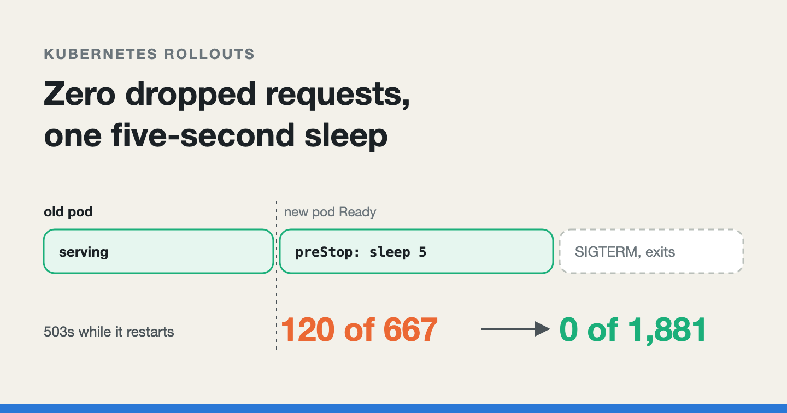
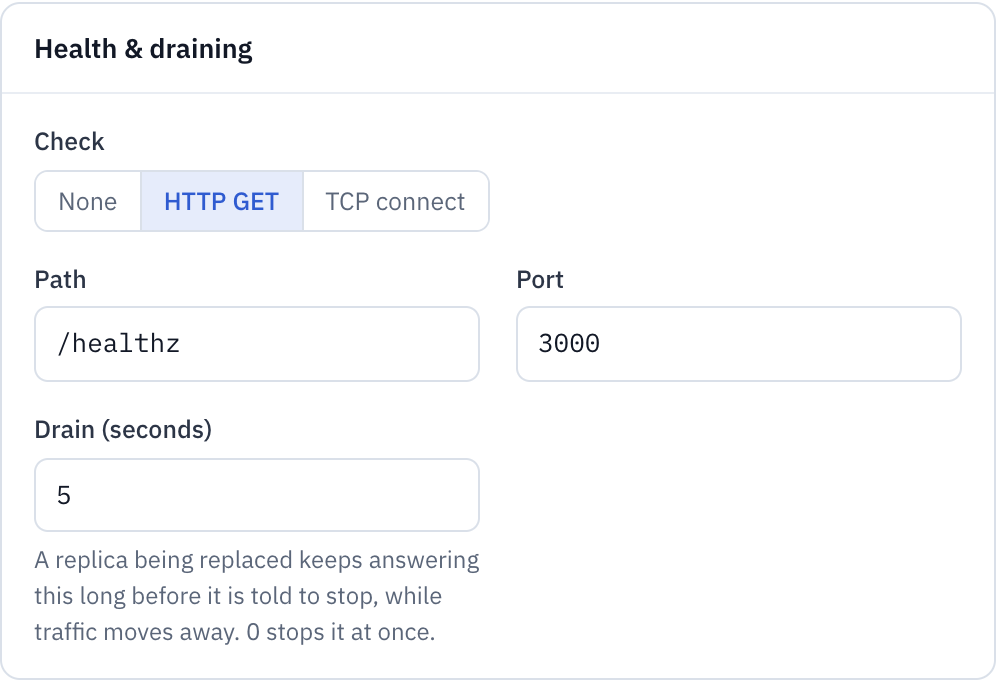
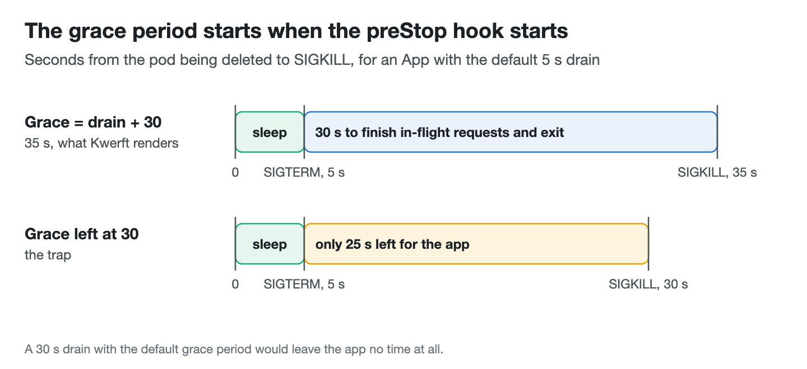
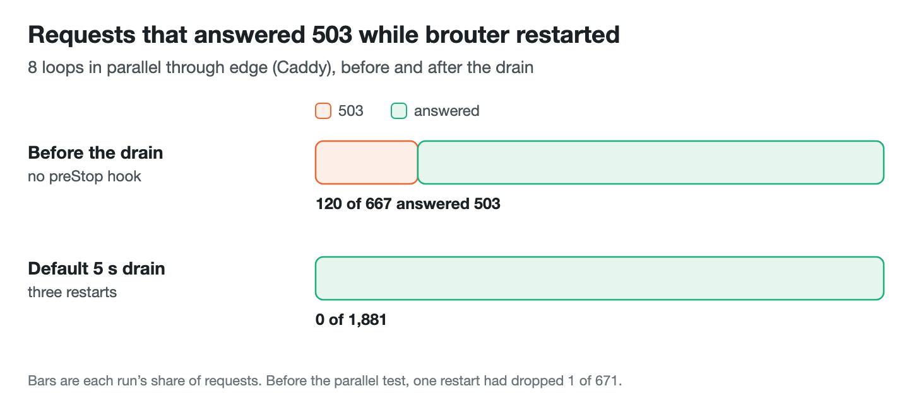

# Zero dropped requests during a Kubernetes rollout: the case for a preStop sleep

*A restart that answered 503 to 120 of 667 requests, why a pod keeps getting
traffic after Kubernetes has stopped routing to it, and the five-second fix
that took the count to zero.*



---

[Kwerft](https://kwerft.dev/?utm_source=medium&utm_medium=blog&utm_campaign=rollout-drain)
is a self-hosted Kubernetes console for Hetzner servers. One bash script
installs k3s, Cilium, Traefik and a single Go binary on a fresh Ubuntu box,
and from then on you deploy Apps, run Tasks and attach Volumes from a web UI.
Under the hood an App is a custom resource, and a reconciler turns it into a
Deployment, a Service and the routes in front of it.

Restarting an App is routine in Kwerft. You can press a button, and a
scheduled Task can restart an App when it succeeds, for example after it has
refreshed the App's data. Every restart is a rolling update: a new pod
starts, becomes Ready, and the old one stops. That is meant to be invisible.
It wasn't. Restarting an App called `brouter`, a routing service sitting
behind a Caddy reverse proxy App called `edge`, dropped requests. With
enough traffic, about one request in six came back as a 503.

This post walks through how I measured it, why a pod that Kubernetes has
already taken out of a Service still receives requests, the fix (a `preStop`
sleep that the kubelet runs itself), what the fix does not cover, and how an
HTTP server should shut down so the rest of the gap closes too.

*I drafted this post with the help of an AI writing assistant. The system, the bugs and the numbers are Kwerft's own.*

## A rollout that starts the new pod first

The rollout strategy was already the careful one. Kwerft renders every App
without disks of its own as a Deployment that starts a new replica before it
stops an old one:

```go
func (a *appRender) deployment() *appsv1ac.DeploymentApplyConfiguration {
	return appsv1ac.Deployment(a.app.Name, a.app.Namespace).
		// …
		WithSpec(appsv1ac.DeploymentSpec().
			WithReplicas(a.replicas()).
			// …
			// Start the new replica before stopping an old one, which drains
			// first (drainSeconds): no downtime as long as the health check
			// is honest.
			WithStrategy(appsv1ac.DeploymentStrategy().
				WithType(appsv1.RollingUpdateDeploymentStrategyType).
				WithRollingUpdate(appsv1ac.RollingUpdateDeployment().
					WithMaxUnavailable(intstr.FromInt32(0)).
					WithMaxSurge(intstr.FromInt32(1)))).
			WithTemplate(a.podTemplate()))
}
```

`maxSurge: 1` allows one pod above the desired count, and
`maxUnavailable: 0` forbids going below it. For a single-replica App, that
means two pods exist for a while, and the old one is only stopped once the
new one passes its readiness probe. The clause about the drain is part of
the fix; the rest of the comment, "no downtime as long as the health check
is honest", is older than the bug. The health check was honest. The
downtime came from somewhere else.

During one restart of `brouter`, 1 of 671 requests through `edge` failed.
One in 671 is the kind of number that is easy to dismiss as noise. But a
restart is not a rare event on a platform that restarts Apps on a schedule,
and a failure that comes with every restart is not noise.

## Making one request in 671 reproducible

To see it properly I made the failure easy to hit: 8 loops in parallel, all
sending requests through `edge` while `brouter` restarted. Before any fix,
**120 of 667 requests answered 503**, and all of them arrived within about
one second of the new pod turning Ready.

That timestamp is the whole diagnosis. The new pod was fine: it was Ready
and answering. The failures clustered at the moment the Deployment
controller, seeing the new pod Ready, removed the old one. The old pod got
SIGTERM, the app inside it exited, and for about a second traffic was still
being sent to it.

More parallel loops meant more requests in flight and more open connections
during that second, which is why the rate jumped from 1 in 671 to 120 in 667.

## Why a deleted pod still gets traffic

When a pod is deleted, two things start at the same time, and nothing in
Kubernetes orders them.

On the node, the kubelet starts stopping the container: it runs the
`preStop` hook if there is one, then sends SIGTERM.

In the control plane, the EndpointSlice controller marks the pod as
terminating. An EndpointSlice is the list of pod addresses behind a Service.
A terminating pod is `ready: false` in it straight away, whatever its
readiness probe last said. That part is correct.

The trouble is everything downstream of the EndpointSlice:

- **The service load balancer has to catch up.** Kwerft runs Cilium with its
  kube-proxy replacement, so Service addresses are translated in eBPF on
  every node. Each Cilium agent has to see the EndpointSlice change and
  update its maps. That takes a moment, and until it has happened, new
  connections can still be sent to the old pod.
- **Open connections do not move.** A connection is balanced once, when it
  opens. After that it goes to the same pod for as long as it lives. Caddy,
  like any reverse proxy, keeps a pool of keep-alive connections to its
  upstream and reuses them. A connection opened to the old pod a minute ago
  is still pointed at the old pod, and the EndpointSlice change does nothing
  to it.

So the old pod was being told to exit at the very moment the rest of the
cluster was still learning that it should stop sending it work. With no
`preStop` hook, SIGTERM arrived at once, and the app exited inside the
window in which it was still receiving requests.


## The alternative I didn't need: failing readiness on shutdown

A common recipe for this problem is to make the app fail its readiness
probe when it receives SIGTERM, wait a while, and only then stop. That takes
the pod out of the Service "properly".

It solves a problem that does not exist. Kubernetes already marks a
terminating pod not ready in its EndpointSlice the moment it starts
terminating, and the probe result plays no part in that. Failing the probe
afterwards removes nothing that isn't already removed. What the recipe
really provides is the *wait*, and the wait is the only part that matters.

That is good news for a platform. Kwerft runs whatever image the user
deploys, and it cannot ask every app to change its signal handling. If the
fix is "wait a few seconds before SIGTERM", the platform can do it on its
own.

## A sleep the kubelet runs itself

The classic way to wait before SIGTERM is a `preStop` exec hook:

```yaml
lifecycle:
  preStop:
    exec:
      command: ["sleep", "5"]
```

That only works if the image has a `sleep` binary. Distroless images, and
anything built `FROM scratch`, don't. The hook fails, the kubelet records an event,
and the container gets SIGTERM straight away. The fix silently does nothing
for exactly the small, static images that Go services are often shipped in.

Kubernetes has a better tool for this now: the `sleep` lifecycle action,
from KEP-3960. It was alpha in Kubernetes 1.29, beta and on by default
since 1.30, and stable since 1.34. The kubelet does the sleeping, so the
image needs nothing at all. Kwerft's installer pins k3s 1.37, so it can
rely on it.

Each App now has a `drainSeconds` field in its spec. The API type keeps the
rules next to the field:

```go
	// DrainSeconds is how long a replica that is being stopped (rollout,
	// restart, scale-down) keeps running before it gets SIGTERM, so Services
	// and callers stop sending it new requests while it still answers. The
	// app then has 30 seconds to exit. 0 stops it at once. Only Apps with
	// ports drain; nothing routes to the others.
	// +kubebuilder:validation:Minimum=0
	// +kubebuilder:validation:Maximum=300
	// +kubebuilder:default=5
	// +optional
	DrainSeconds *int32 `json:"drainSeconds,omitempty"`
```

The default is 5 seconds, and the range is 0 to 300. The API server enforces
both bounds, so an App asking for 301 seconds is refused before any
reconciler sees it. In the UI the field sits under the App's settings, in
"Health & draining", next to the health check.


*Kwerft's console, with the demo data of a fictional web shop.*

The pod renderer turns the field into the hook:

```go
	// A stopping pod leaves the Service's endpoints at once, but Cilium and
	// callers holding keep-alive connections learn it a moment later; it
	// keeps serving until then. The kubelet's own sleep, since distroless
	// images have no sleep binary.
	if p.drainSeconds > 0 {
		c.WithLifecycle(corev1ac.Lifecycle().WithPreStop(corev1ac.LifecycleHandler().
			WithSleep(corev1ac.SleepAction().WithSeconds(int64(p.drainSeconds)))))
	}
```

For an App with ports and the default drain, the Deployment ends up with
these fields:

```yaml
spec:
  strategy:
    type: RollingUpdate
    rollingUpdate:
      maxSurge: 1
      maxUnavailable: 0
  template:
    spec:
      terminationGracePeriodSeconds: 35
      containers:
        - name: app
          # …
          lifecycle:
            preStop:
              sleep:
                seconds: 5
```

During those five seconds the old pod is still running and still answers
anything that reaches it. Meanwhile Cilium updates its maps, and Caddy's
connections to the old pod are either reused for a few more successful
requests or closed. Then SIGTERM arrives, at a pod that nobody is sending
work to any more.

The drain shipped in the 0.6 release candidates (and the last 0.5 one). The
latest stable release, 0.4.0, does not have it yet.

## The grace period starts when the hook starts

There is one trap in adding a `preStop` hook. `terminationGracePeriodSeconds`
is the time between the pod being told to stop and SIGKILL, and it counts
from the start of the `preStop` hook, not from SIGTERM. The default is 30
seconds. A 5-second sleep with the default grace period leaves the app 25
seconds to shut down, and a 30-second drain leaves it nothing.

So the grace period grows with the drain:

```go
// stopSeconds is what a container gets between SIGTERM and SIGKILL after it
// has drained: Kubernetes' default grace period.
const stopSeconds = 30

	// …
	if p.drainSeconds > 0 || p.stopSeconds > 0 {
		stop := int64(stopSeconds)
		if p.stopSeconds > 0 {
			stop = int64(p.stopSeconds)
		}
		// The grace period counts from the start of preStop.
		spec.WithTerminationGracePeriodSeconds(int64(p.drainSeconds) + stop)
	}
```

(`p.stopSeconds` is for Tasks, which can ask for a longer shutdown of their
own. For Apps it is zero, so the stop time is always 30 seconds.)

The envtest suite checks the arithmetic against a real API server: the
default App gets a 5-second sleep and a grace period of 35; at 20 seconds
the numbers become 20 and 50; at 0 the hook disappears and the grace period
is back to Kubernetes' 30.



## Only pods that something routes to

A drain only helps a pod that receives traffic through a Service, and only
Apps with ports have one. So the drain is switched off for everything else:

```go
// defaultDrainSeconds matches the CRD default, for Apps read without it.
const defaultDrainSeconds = 5

// drainSeconds is AppSpec.DrainSeconds; 0 for Apps without ports, which no
// Service routes to.
func (a *appRender) drainSeconds() int32 {
	switch {
	case len(a.app.Spec.Ports) == 0:
		return 0
	case a.app.Spec.DrainSeconds != nil:
		return *a.app.Spec.DrainSeconds
	}
	return defaultDrainSeconds
}
```

A background worker App with no ports stops at once, as before. Kwerft's
Tasks (one-off runs, rendered as Kubernetes Jobs) never drain either, even a
Task created from an App that does. The Task renderer leaves the field at
zero, and a test checks that a Task built from an App gets no lifecycle hook
and no stretched grace period. Delaying the stop of a batch job by five
seconds buys nothing, because nothing is waiting for its answers.

An App with disks of its own runs as a StatefulSet rather than a
Deployment. It uses the same pod template, so it drains the same way, and a
test covers that too.

## The result

The same experiment again, with the default 5-second drain: 8 loops in
parallel through `edge`, three restarts of `brouter`. **0 of 1,881
requests failed.**



The 503s all sat within about one second of the new pod turning Ready, so
the default of five seconds leaves a margin for a busier cluster. An App behind
something slower to notice, such as an external load balancer with its own
health checks, can raise it.

## What the sleep does not fix

The drain closes one gap. Three others are still open, and I'd rather name
them than let the zero above suggest otherwise.

**A request still running when SIGTERM arrives.** The sleep stops new work
from reaching the pod. It does nothing for a slow request that started in
the last moment before the sleep ended. If the app exits on SIGTERM without
finishing what it is doing, that request is lost. The platform can't fix
that; the app has to finish its in-flight requests before it exits (see the
next section).

There is a partial safety net on the caller's side. Go's HTTP client, which
Caddy's reverse proxy is built on, retries an idempotent request (such as a
GET) on a new connection when the reused connection it sent the
request on closed before any answer came back. That covers a server closing
an idle keep-alive connection just as the request went out. It does not
cover a POST, and it does not cover a request the server had already
started working on.

**Apps without a health check.** Without a readiness probe, Kubernetes
considers a container Ready as soon as it has started, which can be well
before the process listens on its port. A rollout can then stop the old
replica while the new one cannot answer yet, and no drain helps with that.
The obvious fix, a default TCP check on the App's first port, would break
Apps that listen somewhere else. This is an open design question in
Kwerft's plan; one option is to default the check in the deploy wizard
instead of in the API. Meanwhile the UI says it plainly: without a check, a
replica gets traffic as soon as it starts.

**The upgrade that adds the drain.** Adding the hook changes the pod
template, so upgrading the controller rolls every App with ports once. That
rollout runs without the drain. The pods being stopped are the old ones,
and the kubelet runs the hooks of the pod it is stopping, which were
created from the old template that had none. The drain starts working from
the restart after.

## General advice: let your Go server finish what it started

This section is not Kwerft code. It is the app-side half of the fix, for
anyone writing an HTTP service in Go that runs behind a load balancer, on
Kubernetes or anywhere else.

`http.Server.Shutdown` does the right thing: it closes the listeners,
closes idle keep-alive connections, and then waits for active requests to
finish. The usual mistake is in the code around it. `ListenAndServe`
returns `http.ErrServerClosed` as soon as `Shutdown` is called, and if
`main` returns at that point, the process exits while requests are still
running. So `main` has to wait for `Shutdown` itself:

```go
func main() {
	srv := &http.Server{Addr: ":8080", Handler: newHandler()}

	ctx, stop := signal.NotifyContext(context.Background(), syscall.SIGTERM, os.Interrupt)
	defer stop()

	go func() {
		if err := srv.ListenAndServe(); err != nil && !errors.Is(err, http.ErrServerClosed) {
			log.Fatal(err)
		}
	}()

	<-ctx.Done() // SIGTERM: on Kubernetes, after any preStop hook has run

	// Stay under the time left before SIGKILL.
	shutdownCtx, cancel := context.WithTimeout(context.Background(), 25*time.Second)
	defer cancel()
	if err := srv.Shutdown(shutdownCtx); err != nil {
		log.Printf("shutdown: %v", err) // some requests did not finish in time
	}
}
```

Two details matter. The timeout should be shorter than the time left
before SIGKILL, so the server gives up on stragglers cleanly instead of
being killed mid-write. And `Shutdown` does not wait for hijacked
connections such as WebSockets; those need their own way to wind down,
registered with `srv.RegisterOnShutdown`.

With both halves in place, the platform waits until no new work arrives,
and the app finishes the work it already has.

## The short version

If you run services behind a Kubernetes Service, on any platform:

1. Starting the new pod first (`maxSurge: 1`, `maxUnavailable: 0`) is
   necessary but not enough. The old pod still gets SIGTERM while traffic
   is on its way to it.
2. Don't bother failing readiness on shutdown. A terminating pod is already
   not ready in its EndpointSlice; what you need is the wait.
3. Use the kubelet's `sleep` lifecycle action for `preStop`, not
   `exec: sleep`. Distroless and scratch images have no `sleep` binary, and
   the exec hook fails without telling you.
4. Add the drain to `terminationGracePeriodSeconds`. The grace period
   starts with the `preStop` hook, so a sleep eats into the app's shutdown
   time.
5. Drain only what something routes to. Workers and batch jobs gain nothing
   from a delayed stop.
6. Shut your server down gracefully on SIGTERM. In Go that is
   `http.Server.Shutdown`, and `main` has to wait for it.
7. Measure with parallel load, and look at *when* the errors happen. One
   failure in 671 became 120 in 667 with eight loops, and the timestamps
   pointed straight at the cause.

---

*I'm Enzo, and I build Kwerft: a Kubernetes console for Hetzner servers, installed with one script. It's open source (AGPL-3.0) on [GitHub](https://github.com/ehilzinger/kwerft), and the install command is on [kwerft.dev](https://kwerft.dev/?utm_source=medium&utm_medium=blog&utm_campaign=rollout-drain). I also build [Hatchure](https://hatchure.app/?utm_source=medium&utm_medium=blog&utm_campaign=rollout-drain), loops to ride, hike and run with a time on every stop, and it runs on Kwerft.*
