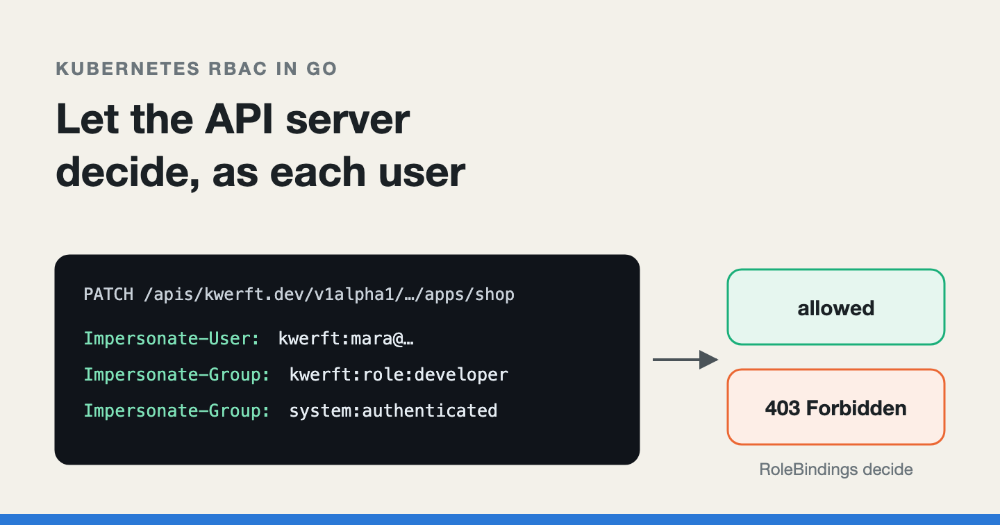
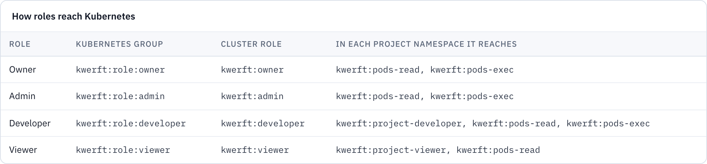
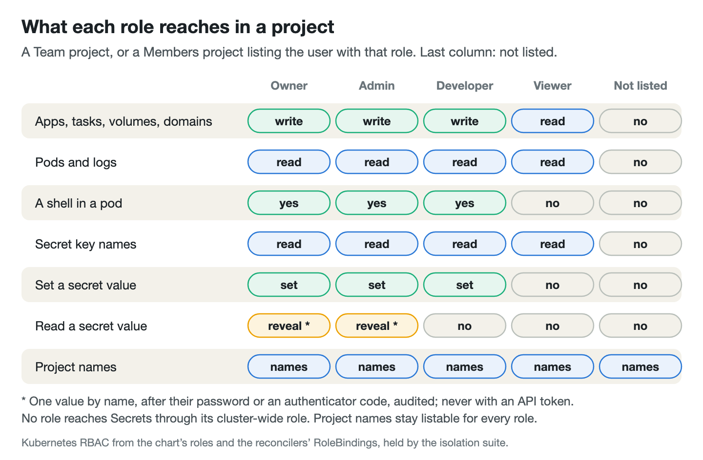
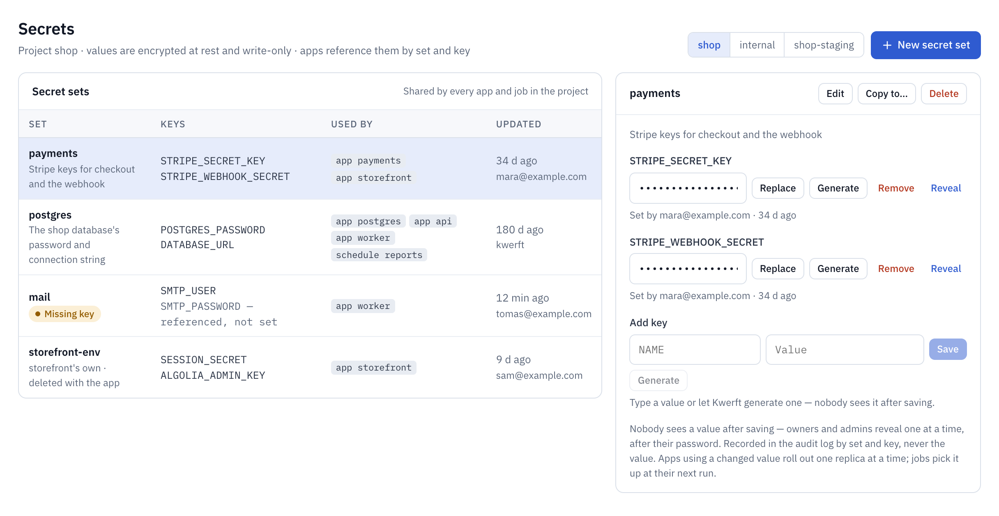

# Let Kubernetes RBAC be your app's authorization layer: impersonation in Go

*How my Kubernetes console acts as each signed-in user instead of as itself,
the one place it deliberately doesn't, and how the same RBAC gives you
secrets your developers can write but never read.*



---

I build [Kwerft](https://kwerft.dev/?utm_source=medium&utm_medium=blog&utm_campaign=rbac-impersonation),
a self-hosted Kubernetes console for Hetzner servers. One bash script turns a
fresh Ubuntu machine into a k3s cluster with a web console: a single Go
binary with the API, the reconcilers and the React UI. Apps, jobs, volumes
and projects are custom resources, and the console writes them for you.

Every console like this has the same problem. Its service account can do
almost anything, because the reconcilers need that. Its users must not. The
usual answer is a role table in the application and a check at the top of
every handler: a second authorization system next to the cluster's own, and
the two drift.

So Kwerft lets Kubernetes decide. The API forwards each user's request with
the user's identity, and RBAC is the final gate. This post shows how that
works in Go, where I read with the console's own rights anyway, how I test
that projects stay isolated, the gaps the tests missed, and what the same
mechanism does for secrets.

*I drafted this post with the help of an AI writing assistant. The system, the bugs and the numbers are Kwerft's own.*

## One identity per user, and a short list of groups

Impersonation is a Kubernetes feature: a client with the `impersonate`
permission sends `Impersonate-User` and `Impersonate-Group` headers, and the
API server authorizes the request as that user instead. The console's
mapping is fixed. A user with the developer role reaches the API server as
user `kwerft:<email>` in the groups `kwerft:role:developer` and
`system:authenticated`. The last one, which real users get too, keeps
discovery and `kubectl auth can-i` working.

The Helm chart gives the console's service account that right, and limits
which groups it may claim:

```yaml
rules:
  - apiGroups: [""]
    resources: [users, serviceaccounts]
    verbs: [impersonate]
  # Only the groups the console hands out (see roles.yaml), never system:masters.
  - apiGroups: [""]
    resources: [groups]
    verbs: [impersonate]
    resourceNames: ["kwerft:role:owner", "kwerft:role:admin", "kwerft:role:developer", "kwerft:role:viewer", "system:authenticated"]
```

The group list is the important half. `system:masters` bypasses RBAC
altogether, and a console that could claim it would be one bug away from
cluster-admin. User names cannot be listed in advance (they are email
addresses), so the `kwerft:` prefix is enforced in Go, not in RBAC. The Go
side also refuses any role it does not know, so a corrupt database row can
never become an arbitrary group:

```go
var Roles = []string{"owner", "admin", "developer", "viewer"}

func impersonation(email, role string) transport.ImpersonationConfig {
	return transport.ImpersonationConfig{
		UserName: UserName(email),                       // "kwerft:" + email
		Groups:   []string{RoleGroup(role), Authenticated}, // "kwerft:role:" + role
	}
}
```

This does not make the console harmless. The same service account still
holds broad rights for the reconcilers, so a compromised console process is
a compromised cluster. What impersonation protects against is the far more
common failure: a handler that forgot a check.

## A client per user that shares one connection pool

A new `rest.Config` per request would mean a new TLS connection per request.
Instead, every impersonating client shares the console's transport, and only
a thin round tripper that adds the headers differs per identity:

```go
func (i *Impersonator) httpClient(email, role string, timeout time.Duration) *http.Client {
	base := i.http.Transport
	// …
	return &http.Client{Transport: transport.NewImpersonatingRoundTripper(impersonation(email, role), base), Timeout: timeout}
}

// For returns a client acting as the console user with this email and role.
func (i *Impersonator) For(email, role string) (client.Client, error) {
	if err := checkIdentity(email, role); err != nil {
		return nil, err
	}
	// … cached per (email, role), at most 256, rebuilt on overflow …
	c, err := client.New(i.cfg, client.Options{HTTPClient: i.httpClient(email, role, i.http.Timeout), Mapper: i.mapper, Scheme: i.scheme})
	// …
}
```

The same type hands out a clientset for log streams and a `rest.Config`
for shells, all with the user's identity. Its one method with the console's
own identity, `Self()`, says in its comment: "Never use it for a write a
user asks for."


## The one place the console reads as itself: polled lists

Writes and single-object reads go through impersonation. The polled list
views (projects, apps, tasks, schedules, volumes, domains) do not. The
overview polls every 15 seconds, and the controller manager already holds
every project's objects in its informer cache, because the reconcilers
watch them. An impersonated list for a developer in five projects is five
API calls, per user, per poll. Reading the cache costs nothing.

The price is a second authorization path. The cache holds everything, so
the console has to filter it, and the filter has to mirror RBAC exactly.
That filter is the project scope in `internal/server/scope.go`:

```go
// projectRole is the user's role in a project, "" when they do not reach it.
func projectRole(u *store.User, p *kwerftv1.Project) string {
	switch {
	case u.Role == store.RoleOwner || u.Role == store.RoleAdmin:
		return u.Role
	case p.Spec.Access == kwerftv1.ProjectAccessMembers:
		// Exactly as the RoleBinding names the user (kube.UserName): the
		// console writes the account's own spelling of the address.
		for _, m := range p.Spec.Members {
			if m.User == u.Email {
				return m.Role
			}
		}
		return ""
	default: // Team, also when unset (Projects made before Phase 4)
		return u.Role
	}
}
```

I keep that path narrow. The list summaries leave out environment
variables and commands, so a mistake in the filter would leak names and
states, not configuration. A namespace counts only if the Project reconciler
labelled it for that project, so a Project named after an existing
namespace cannot open its logs. The scope is only ever meant to narrow a
list, never to widen it, and it is tested against the same cases as RBAC.
I still treat every line of it as a copy of a RoleBinding.

## Project access as RoleBindings

The Project reconciler writes the RoleBindings it mirrors. A project has
access Team (every console user, with their console role) or Members (only
the listed users, each with a project role), and both become RoleBindings in
the project's namespace:

```go
if p.Spec.Access == kwerftv1.ProjectAccessMembers {
	for _, m := range members {
		s := userSubject(m.User) // kwerft:<email>
		switch m.Role {
		case "developer":
			dev = append(dev, s)
			exec = append(exec, s)
		case "viewer":
			view = append(view, s)
		// …
		}
		read = append(read, s)
	}
} else {
	dev = append(dev, groupSubject("developer")) // kwerft:role:developer
	view = append(view, groupSubject("viewer"))
	read = append(read, groupSubject("developer"), groupSubject("viewer"))
	exec = append(exec, groupSubject("developer"))
}
```

Developers and viewers hold almost nothing cluster-wide: reads of a few
cluster-scoped kinds. The chart's comment on that role is its most useful
line: "Never "*" here: bound cluster-wide, a rule on "*"
would reach every project's namespaced objects too." A wildcard is safe in a
ClusterRole that a RoleBinding confines to one namespace, and a leak in one
bound cluster-wide.


*Kwerft's console, with the demo data of a fictional web shop.*



## Proving it against a real API server

Phase 4's exit criterion was that a developer in one project cannot read
another project's pods, logs, secrets, metrics, alerts, builds or traffic,
proven by an automated suite against a real API server. That suite is `internal/server/isolation_test.go`. It runs on envtest, which starts a
real `kube-apiserver` and etcd (1.37.0 here) without kubelets. The test
setup applies the chart's actual `roles.yaml` and `rbac.yaml`, with the
template lines dropped, and binds the console's ClusterRole to a test user
standing in for its service account. It tests the RBAC that ships, not a
copy of it.

The cast is three projects: one with two members, one with nobody but
owners and admins, and one Team project. For both members, get, list and
watch on every namespaced kind in the second project, plus a list of
writes, are asked of the API server as the console would impersonate them:

```go
t.Run("Kubernetes refuses members everything in another project", func(t *testing.T) {
	for _, u := range e.members() {
		for _, c := range inB() {
			if review(t, u, authorizationv1.ResourceAttributes{Namespace: c.ns, Verb: c.verb, Group: c.group, Resource: c.res, Subresource: c.sub}) {
				t.Errorf("%s may %s in %q", u.name, c.what, c.ns)
			}
		}
	}
})
```

`review` is a SelfSubjectAccessReview sent through the impersonating
clientset. A review only asks the authorizer, so the suite then makes the
real requests (list pods, read a log, get a Secret, watch apps, add
themselves to the project) and expects `Forbidden` from each. Then it goes
through the console: every list, search and stream, with VictoriaMetrics,
VictoriaLogs and Alertmanager faked so the filters the console sends can be
checked. That is where the cache path gets tested. A second suite runs the
same cast across two API servers, a local cluster and a remote one.

## What the suite did not catch

Two gaps are still open, and both are in the plan's follow-ups.

**Access disappears for a few seconds after an upgrade.** Phase 4 moved
developers' namespaced rights out of a cluster-wide binding and into the
per-project RoleBindings. A chart upgrade takes the cluster-wide rights away
at once; the Project reconciler writes the new bindings on its startup
resync. Between the two, for seconds, developers and viewers have no project
access at all. I documented it while building it; on the test server, Team
projects worked again once the resync had run. The suite cannot see it: it
tests a steady state, never a transition. The fix is to keep the old
binding until the new ones exist, or to have the installer wait for them.

**Some checks use the console role instead of the project role.** In a
Members project, a user's project role replaces their console role. A few
routes never learnt that:

```go
mux.HandleFunc("POST /api/v1/git/check", write(a.requireRole(g.check, store.RoleOwner, store.RoleAdmin, store.RoleDeveloper)))
```

A console viewer who is a developer in a Members project gets a 403 there,
and on the alert-rule writes and parts of the Jobs, Volumes and Schedule
pages. It fails closed, which is the right direction, but it is the same
lesson as the cache: any role check in your own code is a copy of RBAC, and
copies drift. Where the newer secret-set code needs to know in advance, it
asks Kubernetes with a SelfSubjectAccessReview instead.

## kubectl through the same door

Kwerft's API tokens can download a kubeconfig. It points at the console's
proxy at `/k8s/`, not at the API server, which stays on the private
network. The proxy impersonates the token's user exactly like the console
does, and refuses a few things before forwarding anything:

```go
for name := range r.Header {
	if strings.HasPrefix(strings.ToLower(name), "impersonate-") {
		// kubectl --as: the token's identity is all a request gets.
		deny("impersonation headers", "… impersonating someone else (--as, --as-group) is not allowed.")
		return
	}
}
// …
if slices.Contains(kubeDeniedSubresources, k.subresource) || r.Header.Get("Upgrade") != "" || /* … */ {
	deny(k.resource+"/"+k.subresource+" or upgrade", "… Open a shell in the console instead: it is recorded.")
	return
}
if k.group == "" && k.resource == "secrets" {
	deny("secrets", "Secrets are not available through Kwerft's kubeconfig: the console keeps credentials write-only.")
	return
}
```

The header check matters more than it looks: client-go's impersonating
round tripper leaves a request alone that already carries `Impersonate-*`
headers, so a forwarded `--as` would go out with the console's credentials
and the client's chosen identity. exec, attach and port-forward are refused
because Kwerft records shells, in the console.

Tokens carry a role cap. Instead of teaching every check about caps, a
token's request acts as a copy of the user whose role is the lower of the
cap and the user's current role. Every check and every impersonated request
honours the cap unchanged, and a demotion applies at once.

## Secrets your developers can write but never read

Until Phase 6, Apps could reference a Kubernetes Secret, but nothing in
Kwerft could create one: the API reads no Secrets and the proxy refuses
them. I decided against Vault or OpenBao:
k3s already encrypts Secrets at rest, project RBAC already covers them, and
a vault is another stateful service to unseal and back up, on a server that
may have 4 GB of memory. Teams that already run one can get the External
Secrets Operator later.

So a `SecretSet` is a custom resource that owns one ordinary Secret of the
same name, labelled `kwerft.dev/secret-set`. Secret sets are only in the 0.6 release
candidates so far, not in the stable v0.4.0.

The write-only part is RBAC. In each project namespace, the SecretSet
reconciler keeps a Role `kwerft:secret-sets` with `patch` on exactly the
managed Secrets, bound to owners, admins and the project's developers. No
`get`, no `list`:

```go
for _, role := range []struct {
	name, verb string
	subjects   []rbacv1.Subject
}{{SecretSetsRole, "patch", writers}, {SecretSetsReadRole, "get", readers}} {
	ac := rbacv1ac.Role(role.name, namespace).WithLabels(map[string]string{LabelManagedBy: ManagedByKwerft})
	if len(names) > 0 {
		ac.WithRules(rbacv1ac.PolicyRule().WithAPIGroups("").WithResources("secrets").WithVerbs(role.verb).WithResourceNames(names...))
	}
	// … apply the Role and its RoleBinding …
}
```

The `len(names) > 0` guard is not tidiness. In RBAC an empty
`resourceNames` means every name, so a project without sets would hand its
developers `patch` on every Secret in the namespace. Without sets, the Role
has no rules.

## The leak: a patch answers with the values

`patch` without `get` looks write-only, and it isn't. A Kubernetes PATCH
answers with the whole updated object. A developer who may patch a Secret
reads every value in it from the response, including the ones someone else
set. I noted that in Phase 4, for the console's own write-only Secrets, and
it is why the kubeconfig proxy refuses Secrets altogether.

For the console itself there is a better answer. The API server can return
any object as `PartialObjectMetadata`, metadata only, when the client asks
for that in its `Accept` header. controller-runtime does exactly that when
you hand it a `PartialObjectMetadata` instead of a `corev1.Secret`. Same URL,
a different representation of the answer:

```go
func (a *api) writeKeys(ctx context.Context, c client.Client, set *kwerftv1.SecretSet, data, annotations map[string]any) error {
	raw, err := json.Marshal(map[string]any{"metadata": map[string]any{"annotations": annotations}, "data": data})
	// …
	obj := &metav1.PartialObjectMetadata{}
	obj.SetGroupVersionKind(corev1.SchemeGroupVersion.WithKind("Secret"))
	obj.SetNamespace(set.Namespace)
	obj.SetName(set.Name)
	err := c.Patch(ctx, obj, client.RawPatch(types.MergePatchType, raw))
	// … a set younger than 30 s retries for up to 10 s while its Role catches up …
}
```

`c` is the impersonating client, so RBAC still decides whether the patch is
allowed. On envtest's API server the difference is plain: the ordinary
patch's answer carries the value, the metadata patch's answer only metadata
and `managedFields`, which list key names but no values.

What this does not cover, plainly:

- **Direct API access still could.** RBAC cannot tell response formats
  apart: anyone holding that Role with a raw kubeconfig could ask for the
  full object. That is why the proxy refuses Secrets.
- **Only the secret sets do this so far.** The console's older write-only
  Secrets (the DNS token, the single sign-on client secret, Git and
  notification credentials) still use a plain patch: the console receives
  the value in the answer and drops it.
- **A shell is a shell.** Developers may open a shell in their project's
  pods, and a running process's environment is readable from inside it.
  Write-only is a property of the console and its API, not of the
  container.


## Names without values, reveal, and rotation

A write-only store is useless if nobody can tell what is in it. The API
writes a per-key annotation with each value (who, when, and whether it
was set or generated), and the SecretSet reconciler, with its own
permissions, copies key names and those records into the set's status.
Developers and viewers read the status through the project's RoleBindings,
so listing secrets never touches a Secret. It lives in the namespaced set,
not in the cluster-scoped Project, which every role can read: that would
leak key names across projects.


*Kwerft's console, with the demo data of a fictional web shop.*

Owners and admins can reveal one value, after their password or a current
authenticator code, and the reveal is audited as `secret.reveal`. Even that
goes through impersonation. The cluster-wide owner role reaches no Secrets
at all; a second Role, `kwerft:secret-sets-read`, gives owners and admins
`get` on exactly the managed Secrets by name. API tokens never reveal. The
isolation suite plants a known value in two projects and checks that no
endpoint answers with either one, for any role, and that another project's
key names come back as 403.

For rotation, the App reconciler hashes the values of every Secret key an
App's environment references (sorted, length-prefixed) and puts the hash
into the pod template as `kwerft.dev/secrets-hash`. A new value changes the
template and rolls the App like a restart, without a new revision. Secrets
mounted as files are not hashed, since the kubelet updates those files
itself, and Tasks read the value at their next run. A reference to a key
that does not exist sets the App's condition `SecretMissing` instead of
leaving new pods in `CreateContainerConfigError`.

Writing this post turned up a flaw in that hash. Up to v0.6.0-rc.3 it was a
plain SHA-256. Pods are readable by every role, viewers included, and the
key names are in the set's status. For a long generated value that reveals
nothing; for a short one a person typed, a viewer could test guesses
against it offline. Since rc.4 the hash is an HMAC-SHA256 under a key of its
own, a Secret the chart creates once on the console and on every agent
cluster. It is deliberately not the console's data key: agent clusters have
none, and rotating the data key would then roll every App. The upgrade to
rc.4 rolls every App that references secrets once.

## The short version

If you are building anything that acts on a Kubernetes cluster for other
people:

1. Impersonate the user for every write and every single-object read, and
   let RBAC be the final gate. Your own checks are for clear error
   messages, not for security.
2. Give your service account `impersonate` on an explicit list of groups,
   and never `system:masters`. Enforce the user-name prefix in code.
3. Share one transport across all impersonated clients; only the round
   tripper that adds the headers needs to differ.
4. If you read with your own rights for speed, keep that path narrow, leave
   sensitive fields out of it, and test it against the same cases as RBAC.
5. Never put `"*"` in a ClusterRole you bind cluster-wide for a limited
   role, and never write a Role with an empty `resourceNames` list.
6. Test isolation against a real API server with the RBAC you actually
   ship, using both access reviews and real requests.
7. `patch` without `get` is not write-only. Ask for metadata-only answers,
   and keep Secrets out of any raw proxy you expose.
8. Put a keyed hash (an HMAC, not a plain SHA-256) of the referenced secret
   values into the pod template, so a rotation rolls the app without
   handing readers of the pod a way to test guesses.

---

*I'm Enzo, and I build Kwerft: a Kubernetes console for Hetzner servers, installed with one script. It's open source (AGPL-3.0) on [GitHub](https://github.com/ehilzinger/kwerft), and the install command is on [kwerft.dev](https://kwerft.dev/?utm_source=medium&utm_medium=blog&utm_campaign=rbac-impersonation).*
