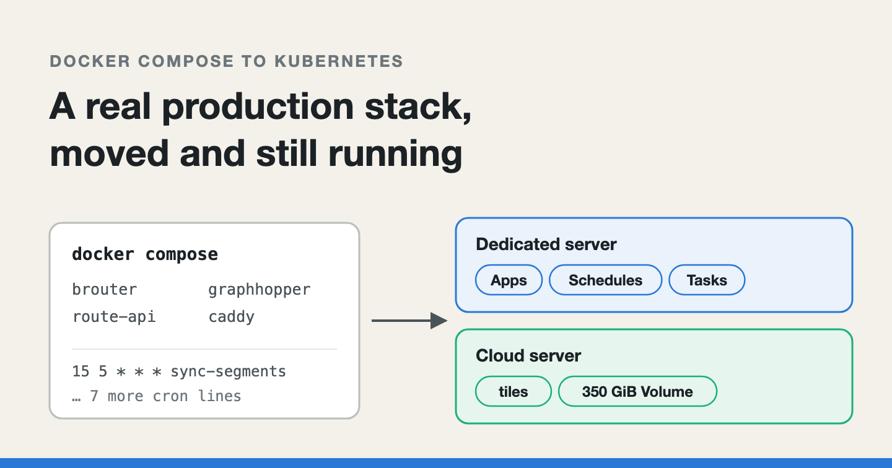
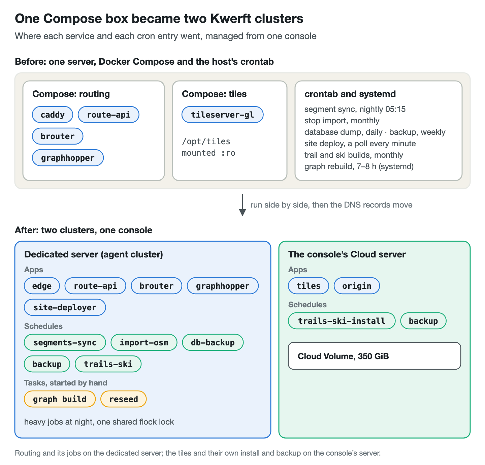
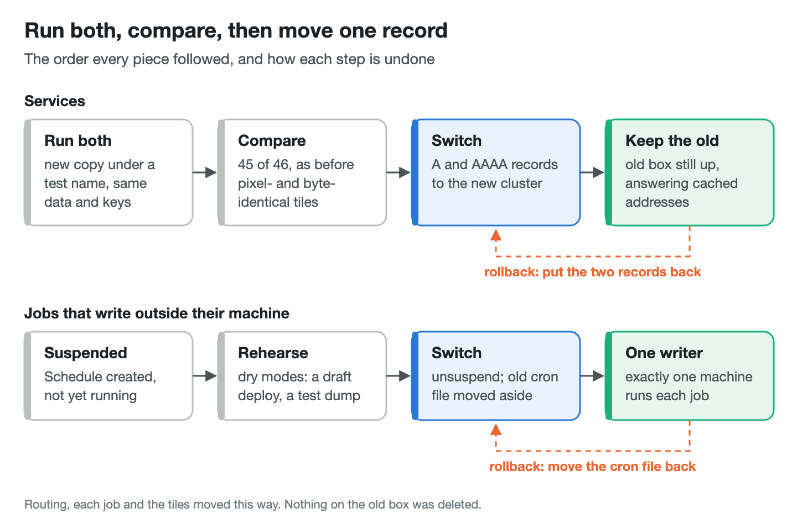
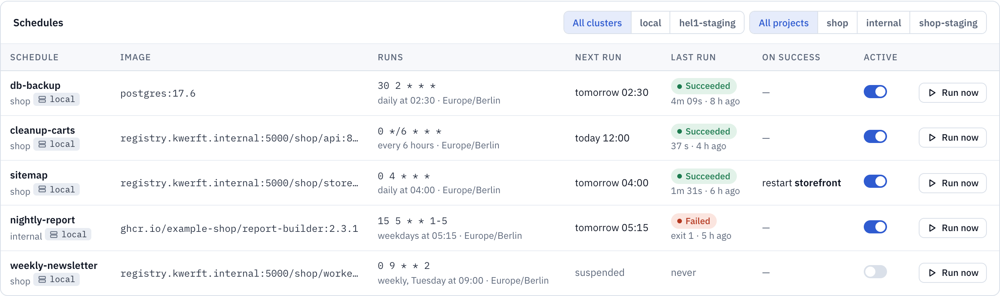

# Moving a real production stack from Docker Compose onto my own Kubernetes platform

*A routing backend, eight cron jobs and a quarter of a terabyte of map
tiles left one Compose box for two Kubernetes clusters. What the move found
missing in the platform, and the cutover pattern that kept a rollback one
DNS change away.*



---

[Kwerft](https://kwerft.dev/?utm_source=medium&utm_medium=blog&utm_campaign=compose-migration)
is a Kubernetes console for Hetzner servers. One bash script installs k3s,
Cilium, Traefik, cert-manager and a single Go binary (the API, the
reconcilers and a React console) on a fresh Ubuntu server. Instead of
Deployments and CronJobs you write a few custom resources of its own:
an `App`, a `Task`, a `Schedule`, a `Volume`.

A platform like this is easy to get right on demo apps and hard to get
right on a real one. My real one is
[Hatchure](https://hatchure.app/?utm_source=medium&utm_medium=blog&utm_campaign=kwerft-migration),
which plans loops to ride, hike and run, with a time on every stop. Its
backend lived on one server under Docker Compose: a routing stack of
GraphHopper, BRouter, a small route API and Caddy in front, a tile server
with about 255 GB of map data, and the host's crontab. Kwerft's plan
records it plainly: the first pilot had "eight cron jobs and a dozen jobs started by
hand next to its six services". Real workloads are mostly not services.

This post walks through that move: how the cutover was done so that every
step could be undone, and each thing the migration found that Kwerft did
not handle yet, with the change it became. Most of it happened in one day,
which is exactly why the gaps were so visible.

*I drafted this post with the help of an AI writing assistant. The system, the bugs and the numbers are Kwerft's own.*

## What moved, and where

The old box ran two Compose projects. The routing one held `brouter`,
`graphhopper`, `route-api` and `caddy`; the tile one held tileserver-gl,
mounting `/opt/tiles` read-only. Around them sat cron files: a nightly
BRouter segment sync, a monthly OpenStreetMap stop import, a daily database
dump, a weekly backup, a site deployer polling every minute, monthly trail
and ski tile builds. A GraphHopper graph rebuild ran for seven to eight
hours under systemd.

It went to two Kwerft clusters, managed from one console:

- **A dedicated Hetzner server** joined the console as an agent cluster: a
  single-node k3s that the console drives through a tunnel. It runs the
  routing stack, the site deployer and nearly every job.
- **The console's own Cloud server** took the tiles, on a 350 GiB Hetzner
  Cloud Volume, a network disk that can move between Cloud servers. The
  tiles' own install and backup jobs run there too.



The original plan put the heavy batch work (the graph build, the tile
builds) on Cloud servers created for one run and deleted after. That did
not survive contact with the account: a graph build wants a large
dedicated-vCPU server, and Hetzner would not raise the limit. So every heavy
job now runs on the dedicated server at night, and each one takes the same
`flock` lock on a shared volume first, so they never overlap. The cost is
real: while the graph build runs, it pushes the served graph out of the page
cache and routes are slower.

## The rule: run both, then move one record

Every piece moved the same way. The new copy started next to the old one,
under a test name in the console's apps domain, such as
`router-next.apps.kwerft.dev`. It got the same data (copied, not shared)
and the same keys. Then the two were compared, and only then did the public
name move.

The comparisons were concrete:

- **Routing:** the API's request collection passed 45 of 46 against the new
  stack, as it did against the old one (the one failure is a known
  too-long route).
- **Tiles:** renders came out pixel-identical, and the data, the drawings
  and the ski list byte-identical, after counting files and bytes per
  folder.
- **Speed:** cold tile renders were about twice as slow, a p50 of 0.49 s
  against 0.27 s. The new home is a 4-vCPU Cloud server. A CDN sits in front
  and only its misses reach the origin, so I accepted it, but it is slower.

The switch itself was the DNS records, A and AAAA. The old box was left
running with its containers up, so clients with the old address cached
still got answers. Rollback was putting the two records back.



Jobs need one more rule, because two copies of a job are not harmless. A
database dump, a site deploy or an import writes somewhere outside its
machine, so it must run from exactly one machine at a time. Each such
Schedule was created suspended. Rehearsals used the jobs' dry modes: a draft
site deploy (245 s), a test dump (1.67 GB, the same size as the old box's).
At the switch, the Schedule was unsuspended and the cron file on the old box
was moved into a folder beside it, not deleted. Rollback for a job is
moving the file back.

## A cron line becomes a Schedule

Here is the nightly segment sync on the old box. The cron file:

```bash
15 5 * * * root REGION="…" /opt/brouter/bin/sync-segments.sh >> /var/log/brouter-sync.log 2>&1
```

and the last lines of the script it runs:

```bash
msg="updated $changed segment files"
# …
(( changed == 0 )) || [ "${RESTART:-1}" = 0 ] || docker compose restart brouter
```

The script restarts BRouter itself, through the Docker socket, so it can
reopen the files it replaced. The provisioning script's comment accepts
that "the two-second restart" lands at 05:15, "when nobody is planning a
route".

On Kwerft the same job is a Schedule:

```yaml
apiVersion: kwerft.dev/v1alpha1
kind: Schedule
metadata:
  name: segments-sync
  namespace: hatchure
spec:
  schedule: "15 5 * * *"
  timeZone: Europe/Berlin
  concurrency: Forbid
  task:
    source:
      image:
        ref: ghcr.io/ehilzinger/hatchure-brouter:54025ee
        pullSecret: ghcr
    command: [/opt/brouter/sync-segments.sh]
    egress: https
    volumes:
      - {path: /segments4, volume: segments}
    timeout: 1h
    onSuccess:
      restart: [brouter]
```

Two details carry the weight. `timeZone` keeps the old box's wall-clock
times, so nothing moved by an hour. And `onSuccess.restart` replaces the
`docker compose restart`: the job no longer restarts anything. Under k3s
there is no Docker socket, and a job holding permission to restart other
workloads is exactly what a platform should avoid. Kwerft does it instead,
once the run succeeds.

That is also why a Schedule is not a CronJob. The reconciler's comment
gives the reason:

```go
// ScheduleReconciler starts a Task whenever a Schedule is due. It schedules
// itself, requeueing until the next run, instead of rendering a CronJob: a
// CronJob can only create Jobs, and creating Tasks from a pod would need
// RBAC inside the project.
```

Each run is a Task, so a scheduled run and one started by hand look the same
in the console. Task and Schedule were added to Kwerft's first version
because of this pilot, before the move started. Everything below was found
during it.


*Kwerft's console, with the demo data of a fictional web shop.*

## Restarts that dropped requests

The first gap appeared within hours. Kwerft rolls an App out new pod first:
the old replica stops only once its successor is ready. That should make
the nightly BRouter restart free. It did not. The old pod got SIGTERM the
moment the new one was ready, while Cilium and Caddy's keep-alive
connections were still sending to it. In a test of eight parallel request
loops through the edge, 120 of 667 requests answered 503 in the second
after the new pod turned ready.

The fix is a drain: every App with ports gets a `preStop` sleep before
SIGTERM, `drainSeconds`, five by default. It uses the kubelet's own sleep,
since distroless images have no `sleep` binary:

```go
if p.drainSeconds > 0 {
	c.WithLifecycle(corev1ac.Lifecycle().WithPreStop(corev1ac.LifecycleHandler().
		WithSleep(corev1ac.SleepAction().WithSeconds(int64(p.drainSeconds)))))
}
```

With it, three restarts under the same load dropped 0 of 1,881 requests. It
does not cover a request still running when SIGTERM finally arrives: an app
that exits at once instead of finishing it still loses that request. (The
drain has a post of its own.)

## A job that needs more than 30 seconds to stop

Hatchure's landmark seeder runs for hours. When it gets SIGTERM, it hands
out no new area and finishes the ones in flight, which can take minutes.
Kubernetes gives a pod 30 seconds between SIGTERM and SIGKILL, and Kwerft
had no way to change that for a Task. Cancelling a reseed cut the areas in
hand short, and the next run had to do them again.

Tasks now have `stopSeconds`, from 1 to 3,600, default 30. The reseed Task
asks for ten minutes:

```yaml
kind: Task
spec:
  fromApp: seeder
  # …
  timeout: 20h
  # On SIGTERM the seeder finishes the areas in hand (src/pool.js) before it
  # exits; Kwerft's stopSeconds (2026-10-05) gives it the ten minutes it wants.
  stopSeconds: 600
```

In the render, both knobs end up in one number, because the grace period
counts from the start of the `preStop` hook:

```go
// The grace period counts from the start of preStop.
spec.WithTerminationGracePeriodSeconds(int64(p.drainSeconds) + stop)
```

`timeout` and `stopSeconds` answer different questions. One is how long the
work may take, the other how long cleaning up may take. A job that saves
its progress on SIGTERM needs both.

## Secrets as files, and the permission ssh checks

On the old box, keys were files: a GitHub deploy key for the site, an
rclone config, a backup server's SSH key. Kwerft only had Secrets as
environment variables. Most scripts could take their config from the
environment (rclone can), but an SSH deploy key has to be a file.

Apps and Tasks can now mount a Secret as files, read-only, one file per key,
with an optional `mode`. The site deployer mounts its deploy key like this:

```yaml
  volumes:
    - {path: /site, volume: site}
    # The read-only GitHub deploy key, root-owned 0444: readable by uid 1000,
    # and ssh accepts it because the running user does not own it.
    - {path: /secrets/site, secret: site-deploy-key}
```

The default mode, 0444, looks wrong at first. It is world-readable, and ssh
is famous for refusing keys with loose permissions. But Kwerft sets no
`fsGroup`, so the Secret's files belong to root. A container running as
uid 1000 can only read them if they are world-readable. And ssh rejects
loose permissions only on keys owned by its own user, so a root-owned 0444
key passes. The one case that needs more is a container that runs as root
and hands the key to ssh: then the key is its own, and it needs 0400, which
YAML spells `mode: 256`.

A missing Secret leaves the pods waiting in ContainerCreating, as
Kubernetes does, and the App's status message names the Secret.

## One port, two hostnames, while a site moves

The routing edge had to answer under two names at once: the test name,
which the console's DNS keeps, and the real `router.hatchure.app`. The real
name's certificate can only be issued over HTTP-01 once its record points at
the new cluster, so it has to be configured before the switch, while the
test name keeps working.

The obvious spelling was to list the port twice:

```yaml
  ports:
    - container: 8080
      public: router-next.apps.kwerft.dev
    - container: 8080
      public: router.hatchure.app
```

Kwerft refused it. Had the API let it through, the render would have put
the port into the Service twice, which is an invalid Service, and given
both hostnames one route name, so the second overwrote the first. Now the
Service and the container list each port once, and each hostname gets its
own route: the first keeps `<app>-<port>`, further ones `<app>-<port>-<n>`.
Until the record moved, the real name's certificate simply stayed pending.

## The read-only mount that made a disk read-only

The tiles found the worst bug. The old Compose file mounted the tile folder
`:ro`, and I carried the habit over: the tile server and the Caddy origin
mounted the Cloud Volume with `readOnly: true`. Then an install Task, which
writes new trail and ski archives into the same Volume, never started. It
sat in ContainerCreating, and the only clue was the kubelet's event:
"Resource busy".

The cause is in how Hetzner's Cloud CSI driver mounts a volume. It has no
staging mount. It mounts the device itself for every pod, with `ro` when the
claim is read-only. The first read-only mount on a node made the ext4
filesystem read-only, and every read-write mount after it failed with
EBUSY. Kwerft had passed `readOnly` to the claim:

```go
WithPersistentVolumeClaim(corev1ac.PersistentVolumeClaimVolumeSource().
	WithClaimName(volumeClaimName(v.Volume)).
	WithReadOnly(v.ReadOnly)))
```

The workaround that day was in the manifests: mount read-write everywhere.
The fix in Kwerft drops `WithReadOnly` from the claim and keeps only the
container's `readOnly` mount, a read-only bind mount that leaves the
device's filesystem read-write.

The second half of the fix is about the clue. A pod waiting for a disk now
shows the kubelet's FailedMount or FailedAttachVolume event in the App's or
Task's Ready message, re-read every 30 seconds. For EBUSY, the message names
the Apps and Tasks still holding the Volume read-only on that node.

It does not fix pods already running. Upgrading rolls every App with a
read-only shared Volume once, and on Cloud Volumes that rollout waits behind
the old read-only replicas until they are stopped and started again.

## The egress I had closed myself

One more surprise was my own. The routing Apps run with `egress: none`,
which in Kwerft means DNS and the cluster only. I set the same on the tile
server. It started, it served tiles, and every label on the rendered maps
was gone. The styles load their label fonts over HTTPS from the public tile
host, which is the very service being moved. On the old box that call had
simply worked. With egress closed, it failed without an error a person
would see.

Kwerft's default is `https`. The fix was one line: `egress: https`. The
lesson is wider: before closing a service's outbound traffic, find out what
it calls, including its own public name.


Except for Task and Schedule, these are all new since the last stable
release, 0.4.0. Drain, `stopSeconds`, Secrets as files and several hostnames
per port are in the 0.6 release candidates, and the read-only mount fix is
in 0.6.0-rc.2 and later.

## What I did not move to Kwerft yet

Two things are still bridges. Logs and metrics go to Grafana Cloud through a
stopgap Vector DaemonSet, because the dashboards and alert rules live there
and Kwerft does not forward per project yet. And the routing Apps run with
memory requests but no limits. A cgroup memory limit counts the page cache a
pod touches, and the served graph is 51 GB of memory-mapped files. A limit
would keep most of it out of memory, and every route would read from disk.

## The short version

If you are moving a real workload from Compose onto Kubernetes:

1. Run the new copy next to the old one under a test name, and compare
   outputs byte for byte before switching anything.
2. Make the switch a DNS change with the old system still running, so
   rollback is putting the records back.
3. For anything that writes outside its machine, keep exactly one writer:
   create the new job suspended, and move the old cron entry aside rather
   than deleting it.
4. Let the platform restart services after a job, not the job itself. A job
   should need no permissions over other workloads.
5. Give stopping replicas a drain before SIGTERM, and give jobs that save
   progress on SIGTERM more than the default 30 seconds.
6. Do not copy `:ro` habits blindly onto network volumes. Test a read-only
   and a read-write mount of the same disk on the same node.
7. Before closing egress, list every outbound call, including to your own
   public hostnames.
8. When a pod waits, surface the event that says why. "ContainerCreating"
   is not an answer.

---

*I'm Enzo, and I build Kwerft: a Kubernetes console for Hetzner servers, installed with one script, with Hatchure as its first real workload. It's open source (AGPL-3.0) on [GitHub](https://github.com/ehilzinger/kwerft), and the install command is on [kwerft.dev](https://kwerft.dev/?utm_source=medium&utm_medium=blog&utm_campaign=compose-migration).*
