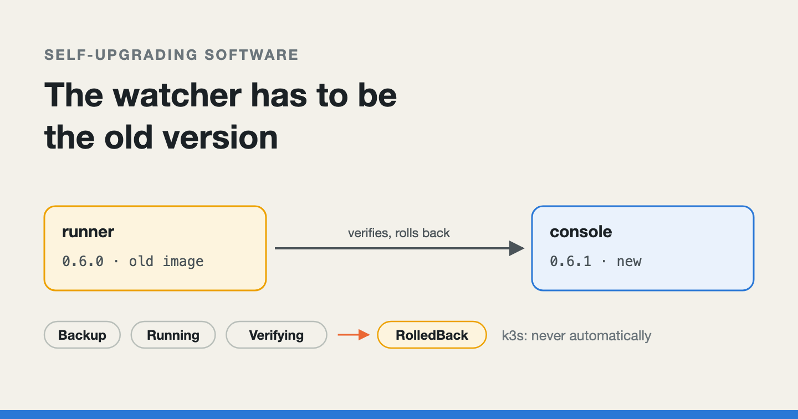
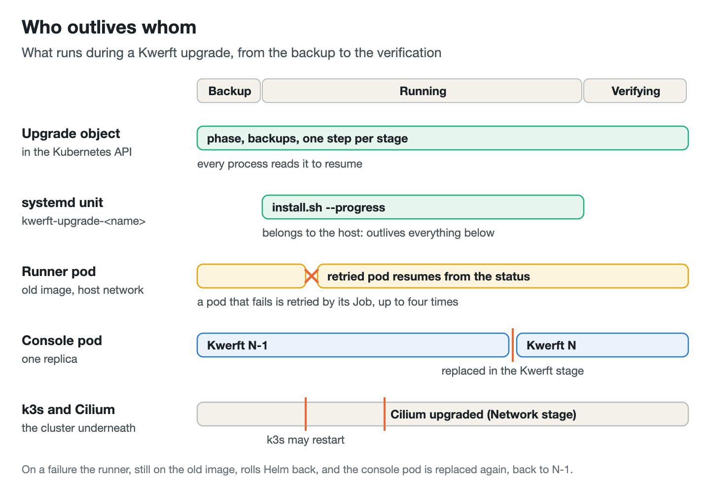
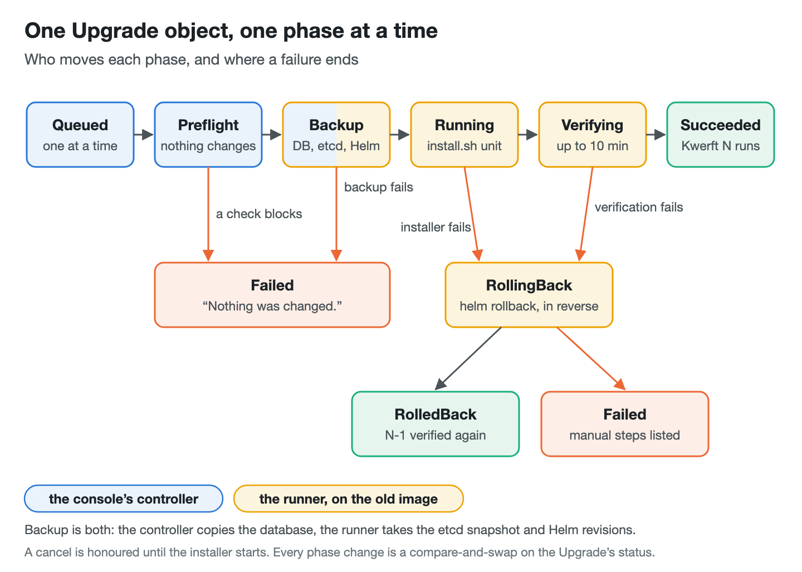
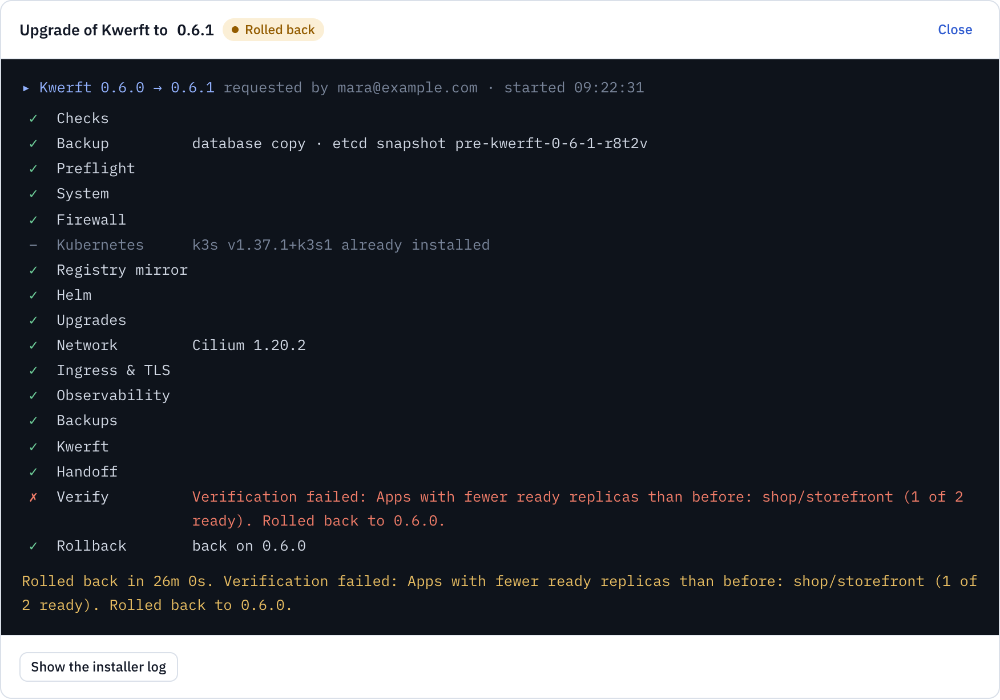
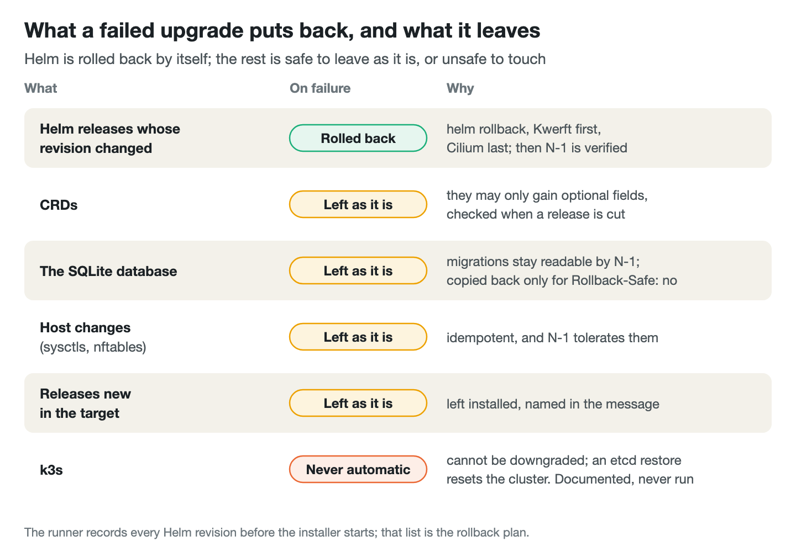
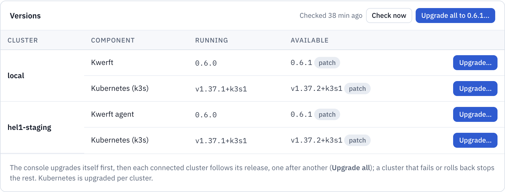

# Self-upgrading software: the watcher has to be the old version

*How a Kubernetes console upgrades itself from its own web page and rolls
back by itself: who does the work, who watches, where the progress lives,
and what is never rolled back automatically.*



---

[Kwerft](https://kwerft.dev/?utm_source=medium&utm_medium=blog&utm_campaign=self-upgrade)
turns a fresh Hetzner server into a small Kubernetes platform with one bash
script: k3s, Cilium for the network, Traefik, cert-manager, metrics and logs,
and a console on top, which is a single Go binary with an embedded web UI and
a SQLite database. Until recently there was one way to upgrade it: run the
installer of the newer release again on the server.

The obvious next feature is an **Upgrade** button in the console. It is also
an odd one, because the program that handles the click is the program being
replaced. Halfway through, the console's own pod is swapped for a new one.
The network plugin that every pod talks through may be swapped too, and k3s
may restart. If the new version is broken, it is in no state to notice that,
let alone undo it.

This post walks through how Kwerft does it: the installer does the work, the
*old* version watches, a systemd unit outlives everything, and the progress
lives in a Kubernetes object. Then it covers what gets rolled back, what
deliberately doesn't, and the first real upgrade, which failed before it
changed anything.

*I drafted this post with the help of an AI writing assistant. The system, the bugs and the numbers are Kwerft's own.*

Console upgrades work from v0.6.0-rc.3 on. rc.1 and rc.2 ship the feature,
but on Ubuntu their runner is refused by the host (the last section explains
why), so those need `install.sh` once. The latest stable release, v0.4.0,
still upgrades by re-running the installer.

## Don't write the upgrade twice

The first decision was what *not* to build. The console could have learnt to
do the upgrade itself in Go: read the new release's chart versions and call
Helm for each one. I rejected that. It would be a second description of how
Kwerft is installed, next to the installer, and the two would drift. The
installer re-run was also the path that was already tested: every release
tag runs an end-to-end install on a fresh Cloud server and an upgrade from
the previous stable release.

So the console decides *when* (preflight checks, policy, maintenance
window), runs the release's own `install.sh` on the host, verifies the
result and rolls back. The installer is a list of stages, and most of them
converge on every run:

```bash
run_stage preflight "Preflight" stage_preflight force
remember_settings
run_stage system    "System"    stage_system force
run_stage firewall  "Firewall"  stage_firewall force
# …
run_stage kubernetes    "Kubernetes"    stage_kubernetes
run_stage registry      "Registry mirror" stage_registry_mirror force
run_stage helm          "Helm"          stage_helm force
run_stage upgrades      "Upgrades"      stage_upgrades force
run_stage network       "Network"       stage_network force
# …
```

`force` means the stage runs every time. `kubernetes` has no `force`: k3s is
installed once and keeps its version, and upgrading it is a separate step
(below).

Two small installer changes made it drivable by a program. Every run now
writes its non-secret flags to `/var/lib/kwerft/install.env`, so a later run
needs only `--version` and `--yes`. And `--progress FILE` writes one JSON
line per stage, then the exit code from the EXIT trap of the top-level
shell:

```bash
#   {"id":"network","label":"Network","state":"ok","detail":"Cilium …","at":"2026-10-05T10:00:00Z"}
# with state ok, skip or fail, and last {"exit":<code>}.

progress_exit() {
  [[ -n "$PROGRESS_FILE" ]] && (( BASH_SUBSHELL == 0 )) || return 0
  printf '{"exit":%d}\n' "$1" >>"$PROGRESS_FILE" 2>/dev/null || true
}
```

The installer's exit codes were already a public contract (10 preflight,
20 network, 30 Kubernetes, 40 platform, 50 Kwerft), so the upgrade's failure
reason is simply the exit code translated into a word.

## The watcher is the old version

An upgrade replaces the console's pod. If the new console were also the
thing that checks the new console, a broken release would be judging
itself. So a separate **runner** drives the upgrade from backup to
verification, and performs the rollback. It is a Kubernetes Job that the
console creates, running `kwerft upgrade-runner` from the *running*
console's image, pinned by its digest. The new release's code never decides
whether the new release worked.

```go
Spec: corev1.PodSpec{
	ServiceAccountName: upgrades.RunnerServiceAccount,
	RestartPolicy:      corev1.RestartPolicyNever,
	// The host's network: a Cilium upgrade does not cut the
	// runner off.
	HostNetwork:  true,
	DNSPolicy:    corev1.DNSClusterFirstWithHostNet,
	NodeSelector: map[string]string{kwerftv1.LabelInstaller: "true"},
	Tolerations:  []corev1.Toleration{{Operator: corev1.TolerationOpExists}},
	// …
```

Cilium carries all pod traffic, and the installer upgrades it in its
Network stage, so the runner uses the host's network. For the same reason it
talks to the Kubernetes API at `https://127.0.0.1:6443` rather than through
the cluster Service. It runs on the one node labelled as the installer's, where the
installer keeps its state, and it tolerates every taint.

## A systemd unit outlives all of them

The runner still runs in a pod, and pods die. The Job retries a failed pod
up to four times, but an installer started *inside* the pod would die with
it. So the runner does not run the installer. It asks the host's systemd to,
as a transient unit:

```go
// Start starts cmd as unit cmd.Unit. RemainAfterExit keeps its exit status
// readable; KillMode=process lets the k3s and helm processes it started
// outlive a stop.
func (h *SystemdHost) Start(ctx context.Context, cmd Command) error {
	args := append([]string{systemdRun, "--unit=" + cmd.Unit, "--quiet",
		"--property=RemainAfterExit=yes", "--property=KillMode=process", "--property=TimeoutStopSec=30",
		"--description=Kwerft upgrade (install.sh)"}, unitArgs(cmd)...)
	// …
```

The unit `kwerft-upgrade-<name>` belongs to the host, not to the pod or to
k3s. The console pod can be replaced, the runner pod can be killed, k3s can
restart, and the installer carries on. `RemainAfterExit` means that whoever
looks next can still read how it ended. The same goes for every other
command the runner needs on the host: the etcd snapshot, Helm, and even
`systemctl` run as transient units (the last section explains why).

The exit code comes from the progress file's last line. If the unit has
gone and that line is missing, the runner treats it as a crash rather than
guessing: "The installer's unit … ended without an exit code (did the server
restart?)".



## The progress lives in the cluster, not in a process

If every process can die, none of them can be the one that remembers how far
the upgrade got. That job belongs to an `Upgrade` custom resource, an object
of Kwerft's own kind stored in the Kubernetes API. Its status holds the
phase, the backups, one step per installer stage and the outcome.

The console's controller owns the first phases and the runner the rest. A
restarted runner reads the phase and carries on from there. That only works
if every phase change is a compare-and-swap, so a runner that resumes late
cannot overwrite a decision someone else already made:

```go
// move changes the phase from `from`, unless something else moved it first.
func (r *Runner) move(ctx context.Context, from kwerftv1.UpgradePhase, mutate func(*kwerftv1.Upgrade)) error {
	_, err := r.Cluster.UpdateStatus(ctx, func(u *kwerftv1.Upgrade) error {
		if u.Status.Phase != from {
			return errPhaseMoved
		}
		mutate(u)
		return nil
	})
	// …
```

Starting the installer must not happen twice either. Before it calls
systemd, the runner writes a `started` marker next to the downloaded
installer, on the host, and it only starts the unit when the unit does not
exist, the marker is absent and the progress file has no exit line. A runner
that comes back mid-install finds the unit running and simply follows it.

The unit tests drive this state machine against a fake host and cluster,
including a runner that resumes while the installer is running, a unit that
vanishes and an installer that hangs (the real limit is 90 minutes).



## Back up three things, and say when nothing changed

Before anything changes, the upgrade takes three copies, and each one has a
job:

- **The SQLite database**, copied by the console itself with `VACUUM INTO`
  to `backups/pre-<upgrade>.db`. That gives a consistent copy while the
  database is open. The newest three are kept.
- **An etcd snapshot**, `k3s etcd-snapshot save --name pre-<upgrade>`, taken
  by the runner. Kwerft never restores it by itself; it is there for a person.
- **The revision of every Helm release** (`helm list -A`), recorded in the
  Upgrade's status. This is the rollback plan.

The runner also checks for 5 GiB of free space, downloads `install.sh`
with its `SHA256SUMS` and the release manifest, verifies the checksum, and
records how many ready replicas every App has. Any failure up to here ends
the Upgrade as `Failed` with a message ending "Nothing was changed." That
sentence mattered more than I expected (last section).

After the installer exits 0, the runner verifies for up to 10 minutes: the
console reports the target version, the CRDs are established, the node agent
has rolled out, the console's domain answers with a valid certificate, and
no App has fewer ready replicas than before. Anything else moves the Upgrade
to `RollingBack`.

## Roll back what Helm changed, in reverse

Rolling back means `helm rollback` to the recorded revision for every
release whose revision changed, in the opposite order to the installer's
stages:

```go
// releaseOrder is the installer's stage order of its Helm releases; a
// rollback goes the other way (Kwerft first, Cilium last). Releases not
// listed (added by later releases) are rolled back right after Kwerft.
var releaseOrder = []string{
	"kube-system/cilium",
	// …
	"traefik/traefik",
	"kwerft-observability/vm",
	"kwerft-observability/vlogs",
	"kwerft-system/kwerft",
}
```

Kwerft goes first because it depends on everything below it. The network
goes last because everything depends on it. Then the runner verifies again,
this time against the *old* version. Success is `RolledBack`. If a rollback
or that check fails, the Upgrade ends `Failed`, and its message lists the
exact `helm rollback` commands to run by hand, plus the names of the
snapshot and the database copy.


*An upgrade that failed its verification, as the console shows it. Demo data; the wording is the runner's.*

Just as deliberate is what is **not** rolled back. CRDs stay as they are.
The database stays as it is. Host changes (sysctls, nftables, the registry
mirror file) stay, because they are idempotent and the old release tolerates
them. Helm releases that are new in the target are left installed and named
in the message. That only works because of rules enforced at release time.

## Make rollback safe when you release, not when you roll back

Once an upgrade has written objects in the new schema, the old console has
to live with them after a rollback. So within `v1alpha1`, CRDs may only gain
optional fields. A small Go tool, `hack/crdcompat`, compares the chart's
CRDs with the previous release tag in the release workflow and fails the
release if they break that rule. This is the heart of it:

```go
// Fields: none removed (a rename is a removal plus an addition), none
// newly required. Required fields inside a new optional field are fine:
// objects of the old release do not have that field at all.
for _, req := range n.Required {
	if !slices.Contains(o.Required, req) {
		if _, existed := o.Properties[req]; existed {
			w.report(path+"."+req, "field became required")
		} else {
			w.report(path+"."+req, "new required field")
		}
	}
}
```

It also flags removed fields, changed types, narrowed enums and tightened
limits. New CEL validation rules only produce a warning, because a tool
cannot tell whether old objects pass them. Run over Kwerft's own history, it
would have caught a real one: between v0.1.0 and v0.4.0, `builds
.spec.source` became a new required field.

The database follows the same idea: a migration has to leave the schema
readable by the release before (expand now, drop in the next release). A
release that cannot keep either promise says so in its tag message with a
`Rollback-Safe: no` trailer. That ends up in the release's `manifest.json`,
the console asks the owner to accept a data rollback, and only then does a
rollback also copy the old database back, losing what was written since.

## Never roll Kubernetes back by itself

k3s gets the opposite treatment. It cannot be downgraded, and restoring an
etcd snapshot resets every Kubernetes object in the cluster to that moment,
Kwerft's own included. An automatic rollback that does that is worse than
the failure it reacts to.

So a Kubernetes upgrade is a separate Upgrade. A patch asks for the
owner's password; a minor also asks them to type the target version, next to
the warning that it cannot be rolled back automatically. It moves through
Rancher's system-upgrade-controller, one node at a time: control-plane nodes
are cordoned, workers are drained with a 10-minute timeout that respects
PodDisruptionBudgets, and a worker alone in its pool is only cordoned, since
its pods would have nowhere to go.

On failure, the controller deletes the upgrade plans so no further node is
touched, and reports which nodes are on which version, the snapshot's name,
and a restore procedure that Kwerft documents and never runs. Nodes one
minor behind keep working within Kubernetes' version skew policy, so fixing
the cause and upgrading again is usually the better path.

The k3s versions on offer come only from Kwerft's own release manifests,
never from k3s's release channel: the installed release's pinned version,
when it is newer than the running one and at most one minor ahead. So every
k3s version a console offers was pinned and tested by a Kwerft release.



## Many clusters, and upgrades nobody clicked

A Kwerft console can also manage other clusters through an agent. **Upgrade
all** upgrades the console first, then each agent cluster in turn, through
the same controller and runner there. An agent is never upgraded past its
console, and a member that ends `Failed` or `RolledBack` stops the rest.

The update policy defaults to **Notify**: the console checks the public
release list every 6 hours and shows what is available. **AutoPatch** is
opt-in, takes the owner's password, and installs patch releases inside a
maintenance window. Minor releases always need a click. An automatic upgrade
that ends `RolledBack` or `Failed` after it reached `Running` pauses
AutoPatch until an owner resumes it; one that failed in preflight or backup
changed nothing, so AutoPatch stays on.


*Kwerft's console, with the demo data of a fictional web shop.*

## Testing a rollback on purpose

A rollback path that never runs doesn't work. The end-to-end harness has a
run for it: install release N-1, upgrade to N through the console's API, and
force a failure *after* the installer succeeded. With a chart value that exists only for tests, an annotation on
the Upgrade makes the runner count the installer as failed with exit code 50.
The run passes only if the Upgrade ends `RolledBack`, the console reports
N-1 again, the owner can sign in, and the test App answers from the same
pods with the same restart counts. During both upgrade runs the harness
requests the App every 2 seconds and reports the longest gap.

I have to be honest about the state of this: as of writing, these upgrade
runs have passed only against a fake console, a fake cloud and fake servers.
The first time the real thing ran, it wasn't in the harness.

## The first real upgrade stopped at its first systemd call

The first console upgrades to 0.6.0-rc.2, on my own production clusters,
ended in the Backup step. The etcd snapshot failed, and the reason inside
the runner's message was systemd's: "Failed to start transient service
unit: Access denied". The message ended, correctly, with "Nothing was
changed."

The etcd snapshot is the runner's first call to `systemd-run`, and it was
refused. containerd's default AppArmor profile keeps a pod off the host's
system bus, which is how `systemd-run` asks systemd to start a unit. The
runner already *is* root on the host through systemd, so confining it bought
nothing. The fix runs its pod unconfined:

```go
// AppArmor Unconfined: containerd's default profile
// keeps a pod off the system bus, so systemd-run gets
// "Access denied"; the runner is root on the host
// through systemd anyway (upgrades.SystemdHost).
SecurityContext: &corev1.SecurityContext{
	AppArmorProfile:          &corev1.AppArmorProfile{Type: corev1.AppArmorProfileTypeUnconfined},
	// …
	Capabilities:             &corev1.Capabilities{Drop: []corev1.Capability{"ALL"}, Add: []corev1.Capability{"SYS_CHROOT"}},
```

The same fix covers a second problem, which probe pods on a test server
(Ubuntu 26.04, systemd 259) showed. `systemctl`, run as root in the chroot,
talks to systemd's private socket, which checks the caller's credentials. The host's
PID 1 is not in the pod's PID namespace, so that check fails with "No data
available". Now `systemctl show`, `stop` and `reset-failed` run on the host
as transient units too, and only `systemd-run` runs in the chroot.

Three things stand out. The fakes could not have caught this, because the
fake host has no AppArmor and no D-Bus: the boundary that failed was the one
the tests replace. The careful ordering paid off, because the failure came
before the installer started and the message could truthfully say that
nothing had changed. And the design has a consequence I had not thought
through: because the watcher is the old version, a bug in the runner can
only be fixed for upgrades *from* the release that contains the fix. The fix
shipped in v0.6.0-rc.3, but a console on rc.2 or earlier still runs its own
broken runner. As the release notes say, those servers move to rc.3 with
`install.sh` once, and console upgrades work from rc.3 on.

## The short version

If you build software that upgrades itself:

1. Let the same code install and upgrade. A second implementation of the
   upgrade is a second source of truth, and it will drift.
2. The process that judges the new version must not be the new version.
   Run the watcher from the old one, pinned by digest.
3. Run the long, destructive step outside everything it replaces: a host
   systemd unit, not a child of a pod.
4. Keep the progress in durable, shared state, and make every phase change a
   compare-and-swap so a resumed worker can't undo a later decision.
5. Back up before you change anything, and say plainly when a failure
   changed nothing.
6. Decide at release time what a rollback can leave behind: schemas that
   only gain optional fields, migrations the previous release can read, and
   a flag for releases that cannot promise either.
7. Don't automate a rollback that is worse than the failure. Stop, name what
   is where, and leave the restore to a person.
8. Remember that a fix to the watcher only helps upgrades from the release
   that contains it.

---

*I'm Enzo, and I build Kwerft: a Kubernetes console for Hetzner servers, installed with one script, which can now upgrade itself. It's open source (AGPL-3.0) on [GitHub](https://github.com/ehilzinger/kwerft), and the install command is on [kwerft.dev](https://kwerft.dev/?utm_source=medium&utm_medium=blog&utm_campaign=self-upgrade).*
